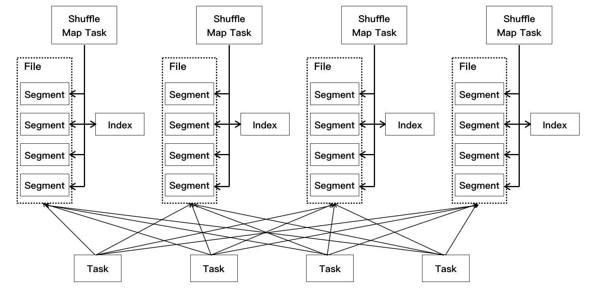
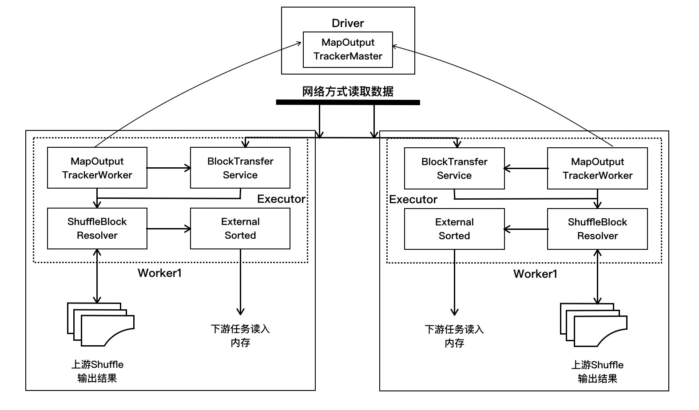

# Spark Shuffle分析

# 目录

* [Shuffle 简介](#shuffle-简介)
* [Shuffle 写操作](#shuffle-写操作)
* [Shuffle 读操作](#shuffle-读操作)


## Shuffle 简介
Hadoop 中的 MapReduce 框架中，Shuffle 是连接 Map 和 Reduce 的桥梁，Map 的输出到 Reduce 中必须经过 Shuffle 这个环节。由于 Shuffle 阶段涉及磁盘的读写和网络传输，
因此 Shuffle 的性能高低影响整个程序的性能和吞吐量。  
Shuffle 的中文意思是"洗牌，混洗"的意思，把分布在不同节点的数据按照一定的规则聚集到一起的过程称为 Shuffle。


## Shuffle 写操作
在 Spark2.0 中，完全抛弃了基于 Hash 的 Shuffle，只有基于排序的 Shuffle，所以，我们就只讨论基于排序的 Shuffle。  
使用基于排序的 Shuffle 主要解决了 Shuffle 过程中产生过多的文件和 Writer Handler 的缓存开销过大的问题，
所以借鉴了 Hadoop 在 Shuffle 中的处理方式。所以在 Sort Based Shuffle 中，每个 Shuffle Map Task 不会为后续的每个任务创建单独的文件，
而是会将所有结果写到同一个文件中，对应生成一个 Index 文件进行索引。通过这种机制避免了大量文件的产生，一方面可以减轻文件系统管理众多文件的压力，
另一方面可以减少 Writer Handler 的缓存所占用的内存大小，节省了内存的同时避免了 GC 的风险和频率。

shuffle 写操作示意图
<div>
    
</div>

对于 Shuffle 的写操作，主要是在 SortShuffleWriter 的 write 方法。在该方法中，首先判断输出结果在 Map 端是否需要合并（Combine）, 如果需要合并，则外部排序中进行聚合并排序；
如果不需要，则外部排序中不进行聚合和排序。例如 sortByKey 操作在 Reduce 端会进行聚合并排序。确认外部排序方式后，在外部排序中将使用 PartitionedAppendOnlyMap 来存放数据，
当排序中的 Map 占用的内存已经超越了使用的阈值，则将 Map 中的内容溢写到磁盘中，每一次溢写产生一个不同的文件，当所有数据处理完毕后，在外部排序中有可能一部分计算结果在内存中，
另一部分计算结果溢写到一或多个文件中，这时通过 merge 操作将内存和 spill 文件中的内容合并整到一个文件中。

SortShuffleWriter 的 write 方法代码如下：

``` scala
override def write(records: Iterator[Product2[K, V]]): Unit = {
    sorter = if (dep.mapSideCombine) {
      require(dep.aggregator.isDefined, "Map-side combine without Aggregator specified!")
      // 外排序中进行聚合
      new ExternalSorter[K, V, C](
        context, dep.aggregator, Some(dep.partitioner), dep.keyOrdering, dep.serializer)
    } else {
      // In this case we pass neither an aggregator nor an ordering to the sorter, because we don't
      // care whether the keys get sorted in each partition; that will be done on the reduce side
      // if the operation being run is sortByKey.
      // 外排序中不进行聚合
      new ExternalSorter[K, V, V](
        context, aggregator = None, Some(dep.partitioner), ordering = None, dep.serializer)
    }
    // 根据获取的排序方式，对数据进行排序并写入到内存缓冲区中。如果排序中的 Map 占用的内存
    // 已经超越来使用的阈值，则将 Map 中的内容溢写到磁盘，每次溢写产生一个不同的文件
    sorter.insertAll(records)

    // Don't bother including the time to open the merged output file in the shuffle write time,
    // because it just opens a single file, so is typically too fast to measure accurately
    // (see SPARK-3570).
    // 通过 Shuffle 编号和 Map 编号获取该数据文件
    val output = shuffleBlockResolver.getDataFile(dep.shuffleId, mapId)
    val tmp = Utils.tempFileWith(output)
    try {
      // 通过 Shuffle 编号和 Map 编号获取 ShuffleBlock 编号
      val blockId = ShuffleBlockId(dep.shuffleId, mapId, IndexShuffleBlockResolver.NOOP_REDUCE_ID)
      // 在外排序中有可能一部分计算结果在内存中，另一部分计算结果溢写到一个或多个文件之中
      // 这时通过 merge 操作将内存和 spill 文件中的内容合并整到一个文件里
      val partitionLengths = sorter.writePartitionedFile(blockId, tmp)
      // 创建索引文件，将每个 partition 的在数据文件中的起始位置和结束位置写入到索引文件
      shuffleBlockResolver.writeIndexFileAndCommit(dep.shuffleId, mapId, partitionLengths, tmp)
      // 将元数据信息写入到 MapStatus 中，后续的任务可以通过该 MapStatus 得到处理结果信息
      mapStatus = MapStatus(blockManager.shuffleServerId, partitionLengths)
    } finally {
      if (tmp.exists() && !tmp.delete()) {
        logError(s"Error while deleting temp file ${tmp.getAbsolutePath}")
      }
    }
  }
```

在 ExternalSorter 的 insterAll 方法中，先判断是否需要进行聚合（Aggregation）,如果需要，则根据键值进行合并（Combine）, 然后把这些数据写入到内存缓冲区中，
如果排序中 Map 占用的内存超过了阈值，则将 Map 中的内容溢写到磁盘中，每一次溢写产生一个不同的文件。如果不需要聚合，把数据排序写到内存缓冲区。

``` scala
def insertAll(records: Iterator[Product2[K, V]]): Unit = {
    // 是否需要聚合
    val shouldCombine = aggregator.isDefined

    if (shouldCombine) {
      // 如果需要聚合，则使用 PartitionedAppendOnlyMap 根据键值进行合并
      val mergeValue = aggregator.get.mergeValue
      val createCombiner = aggregator.get.createCombiner
      var kv: Product2[K, V] = null
      val update = (hadValue: Boolean, oldValue: C) => {
        if (hadValue) mergeValue(oldValue, kv._2) else createCombiner(kv._2)
      }
      while (records.hasNext) {
        addElementsRead()
        kv = records.next()
        map.changeValue((getPartition(kv._1), kv._1), update)
        maybeSpillCollection(usingMap = true)
      }
    } else {
      // Stick values into our buffer
      // 不需要聚合，对数据进行排序写入到内存缓冲区中
      while (records.hasNext) {
        addElementsRead()
        val kv = records.next()
        buffer.insert(getPartition(kv._1), kv._1, kv._2.asInstanceOf[C])
        maybeSpillCollection(usingMap = false)
      }
    }
  }
```

## Shuffle 读操作
<div align=center>
    
</div>

1. 在 SparkEnv 启动时，会对 ShuffleManage、BlockManager 和 MapOutputTracker 等实例化。ShuffleManager 配置项有 SortShuffleManager 和自定义的 ShuffleManager 两种，
SortShuffleManager 实例化 BlockStoreShuffleReader，持有的实例是 IndexShuffleBlockResolver 实例。
2. 在 BlockStoreShuffleReader 的 read 方法中，调用 mapOutputTracker 的 getMapSizesByExecutorId 方法，由 Executor 的 MapOutputTrackerWorker 发送获取结果状态的 
GetMapOutputStatuses 消息给 Driver 端的 MapOutputTrackerMaster，请求获取上游 Shuffle 输出结果对应的 MapStatus，其中存放了结果数据信息，也就是我们之前在[Spark作业执行](./Spark作业执行源码分析.md#获取执行结果)中介绍的 ShuffleMapTask 执行结果元信息。
3. 知道 Shuffle 结果的位置信息后，对这些位置进行筛选，判断是从本地还是远程获取这些数据。如果是本地直接调用 BlockManager 的 getBlockData 方法，在读取数据的时候会根据写入方式的不同采取不同的 ShuffleBlockResolver 读取；如果是在远程节点上，需要通过 Netty 网络方式读取数据。
在远程读取的时候会采用多线程的方式进行读取，一般来说，会启动 5 个线程到 5 个节点进行读取数据，每次请求的数据大小不回超过系统设置的 1/5，该大小由`spark.reducer.maxSizeInFlight`配置项进行设置，默认情况该配置为 48MB。
4. 读取数据后，判断 ShuffleDependency 是否定义聚合（Aggregation）, 如果需要，则根据键值进行聚合。在上游 ShuffleMapTask 已经做了合并，则在合并数据的基础上做键值聚合。待数据处理完毕后，使用外部排序（ExternalSorter）对数据进行排序并放入存储中。

源码：  

1. Shuffle 读的起点是由 ShuffledRDD.compute 发起的，在该方法中会调用 ShuffleManager 的 getReader 方法，在前面我们已经知道 Sort Based Shuffle 使用的是 BlockStoreShuffleReader 的 read 方式。

``` scala
// ResultTask或者ShuffleMapTask，在执行到ShuffledRDD时
// 会调用compute方法来计算partition的数据
override def compute(split: Partition, context: TaskContext): Iterator[(K, C)] = {
  val dep = dependencies.head.asInstanceOf[ShuffleDependency[K, V, C]]
  // 获取 Reader(BlockStoreShuffleReader)，拉取 shuffleMapTask/ResultTask，需要聚合的数据
  SparkEnv.get.shuffleManager.getReader(dep.shuffleHandle, split.index, split.index + 1, context)
    .read()
    .asInstanceOf[Iterator[(K, C)]]
}
```

2. 在 BlockStoreShuffleReader 的 read 方法里先实例化 ShuffleBlockFetcherIterator，在该实例化过程中，通过 MapOutputTracker 的 getMapSizeByExecutorId 获取上游 ShuffleMapTask 输出的元数据。先尝试在本地的 mapStatus 获取，如果获取不到，则通过 RPC 通行框架，发送消息给 MapOutputTrackerMaster，
请求获取该 ShuffleMapTask 输出数据的元数据，获取这些元数据转换成 Seq\[(BlockManagerId, Seq\[(BlockId, Long)\])\] 的序列。在这个序列中的元素包括两部分信息，BlockManagerId 可以定位数据所处的 Executor，而 Seq\[(BlockId,Long)\] 可以定位 Executor 的数据块编号和获取数据的大小。

``` scala
override def read(): Iterator[Product2[K, C]] = {
    // ShuffleBlockFetcherIterator根据得到的地理位置信息，通过BlockManager去远程的
    // ShuffleMapTask所在节点的blockManager去拉取数据
    val blockFetcherItr = new ShuffleBlockFetcherIterator(context,blockManager.shuffleClient,blockManager,
      // 通过MapOutputTracker获取上游的ShuffleMapTask输出数据的元数据，
      // 先尝试从本地获取，获取不到，通过RPC发送消息给MapOutputTrackerMaster,获取元数据
      mapOutputTracker.getMapSizesByExecutorId(handle.shuffleId, startPartition, endPartition),
      // Note: we use getSizeAsMb when no suffix is provided for backwards compatibility
      SparkEnv.get.conf.getSizeAsMb("spark.reducer.maxSizeInFlight", "48m") * 1024 * 1024,
      SparkEnv.get.conf.getInt("spark.reducer.maxReqsInFlight", Int.MaxValue))
    ...
  }
```
在MapOutputTracker的getMapSizesByExecutorId方法代码如下：
``` scala
def getMapSizesByExecutorId(shuffleId: Int, startPartition: Int, endPartition: Int)
      : Seq[(BlockManagerId, Seq[(BlockId, Long)])] = {
    logDebug(s"Fetching outputs for shuffle $shuffleId, partitions $startPartition-$endPartition")
    // 通过shuffleId获取上游ShuffleMapTask输出数据的元数据
    val statuses = getStatuses(shuffleId)
    // Synchronize on the returned array because, on the driver, it gets mutated in place
    // 使用同步的方式把获取到的MapStatuses转为Seq[(BlockManagerId, Seq[(BlockId, Long)])]格式
    statuses.synchronized {
      return MapOutputTracker.convertMapStatuses(shuffleId, startPartition, endPartition, statuses)
    }
  }
```

getStatus(shuffleId)方法如下：

``` scala
private def getStatuses(shuffleId: Int): Array[MapStatus] = {
    // 先尝试在本地读取
    val statuses = mapStatuses.get(shuffleId).orNull
    if (statuses == null) {
      logInfo("Don't have map outputs for shuffle " + shuffleId + ", fetching them")
      val startTime = System.currentTimeMillis
      var fetchedStatuses: Array[MapStatus] = null
      fetching.synchronized {
        // Someone else is fetching it; wait for them to be done
        // 如果其他人也在读取消息，等待其他人读取完毕后再进行读取
        while (fetching.contains(shuffleId)) {
          try {
            fetching.wait()
          } catch {
            case e: InterruptedException =>
          }
        }

        // Either while we waited the fetch happened successfully, or
        // someone fetched it in between the get and the fetching.synchronized.
        fetchedStatuses = mapStatuses.get(shuffleId).orNull
        if (fetchedStatuses == null) {
          // We have to do the fetch, get others to wait for us.
          fetching += shuffleId
        }
      }

      if (fetchedStatuses == null) {
        // We won the race to fetch the statuses; do so
        logInfo("Doing the fetch; tracker endpoint = " + trackerEndpoint)
        // This try-finally prevents hangs due to timeouts:
        try {
          // 发送消息给MapOutputTrackerMaster，获取该ShuffleMapTask输出的元数据
          val fetchedBytes = askTracker[Array[Byte]](GetMapOutputStatuses(shuffleId))
          
          // 对获取的元数据进行反序列化
          fetchedStatuses = MapOutputTracker.deserializeMapStatuses(fetchedBytes)
          logInfo("Got the output locations")
          mapStatuses.put(shuffleId, fetchedStatuses)
        } finally {...}
    ...
  }
```

3. 获取读取数据位置信息后，返回到 ShuffleBlockFetcherIterator 的 initalize 方法，该方法是 Shuffle 读的核心代码所在。

``` scala
private[this] def initialize(): Unit = {
    // Add a task completion callback (called in both success case and failure case) to cleanup.
    context.addTaskCompletionListener(_ => cleanup())

    // Split local and remote blocks. 切分本地和远程 block
    // 对获取数据位置的元数据进行分区，区分为本地节点还是远程节点
    val remoteRequests = splitLocalRemoteBlocks()
    // Add the remote requests into our queue in a random order
    fetchRequests ++= Utils.randomize(remoteRequests)
    assert ((0 == reqsInFlight) == (0 == bytesInFlight),
      "expected reqsInFlight = 0 but found reqsInFlight = " + reqsInFlight +
      ", expected bytesInFlight = 0 but found bytesInFlight = " + bytesInFlight)

    // Send out initial requests for blocks, up to our maxBytesInFlight
    // 对于远程节点数据，使用 Netty 网络方式读取
    fetchUpToMaxBytes()

    val numFetches = remoteRequests.size - fetchRequests.size
    logInfo("Started " + numFetches + " remote fetches in" + Utils.getUsedTimeMs(startTime))

    // Get Local Blocks
    // 对于本地数据，sort Based Shuffle使用的是IndexShuffleBlockResolver的getBlockData方法获取数据
    fetchLocalBlocks()
    logDebug("Got local blocks in " + Utils.getUsedTimeMs(startTime))
  }
```

划分本地节点还是远程节点的 splitLocalRemoteBlocks 方法中划分数据读取方式：

``` scala
private[this] def splitLocalRemoteBlocks(): ArrayBuffer[FetchRequest] = {
    // 设置每次请求的大小不超过 maxBytesInFlight 的 1/5，该阈值由spark.reducer.maxSizeInFlight配置，默认 48MB
    val targetRequestSize = math.max(maxBytesInFlight / 5, 1L)
    logDebug("maxBytesInFlight: " + maxBytesInFlight + ", targetRequestSize: " + targetRequestSize)

    // Split local and remote blocks. Remote blocks are further split into FetchRequests of size
    // at most maxBytesInFlight in order to limit the amount of data in flight.
    val remoteRequests = new ArrayBuffer[FetchRequest]

    // Tracks total number of blocks (including zero sized blocks)
    var totalBlocks = 0
    for ((address, blockInfos) <- blocksByAddress) {
      totalBlocks += blockInfos.size
      if (address.executorId == blockManager.blockManagerId.executorId) {
        // 当数据和所在 BlockManager 在一个节点时，把该信息加入到 localBlocks 列表中，
        // 需要过滤大小为 0 的数据块
        localBlocks ++= blockInfos.filter(_._2 != 0).map(_._1)
        numBlocksToFetch += localBlocks.size
      } else {
        val iterator = blockInfos.iterator
        var curRequestSize = 0L
        var curBlocks = new ArrayBuffer[(BlockId, Long)]
        while (iterator.hasNext) {
          val (blockId, size) = iterator.next()
          // 对于不空数据块，把其信息加入到列表中
          if (size > 0) {
            curBlocks += ((blockId, size))
            remoteBlocks += blockId
            numBlocksToFetch += 1
            curRequestSize += size
          } else if (size < 0) {
            throw new BlockException(blockId, "Negative block size " + size)
          }
          // 按照不大于 maxBytesInFlight 的标准，把这些需要处理数据组合在一起
          if (curRequestSize >= targetRequestSize) {
            // Add this FetchRequest
            remoteRequests += new FetchRequest(address, curBlocks)
            curBlocks = new ArrayBuffer[(BlockId, Long)]
            logDebug(s"Creating fetch request of $curRequestSize at $address")
            curRequestSize = 0
          }
        }
        // 剩余的处理数据组成一次请求
        if (curBlocks.nonEmpty) {
          remoteRequests += new FetchRequest(address, curBlocks)
        }
      }
    }
    logInfo(s"Getting $numBlocksToFetch non-empty blocks out of $totalBlocks blocks")
    remoteRequests
  }
```

4. 数据读取完毕后，回到 BlockStoreShuffleReader 的 read 方法，判断是否定义聚合，如果需要，则根据键值调用 Aggregator 的 combineCombinersByKey
方法进行聚合。聚合完毕，使用外部排序（ExternalSorter）对数据进行排序并放入内存中

``` scala
override def read(): Iterator[Product2[K, C]] = {
    ...
    val aggregatedIter: Iterator[Product2[K, C]] = if (dep.aggregator.isDefined) {
      if (dep.mapSideCombine) {
        // 对于上游 ShuffleMapTask 已经合并的，对合并结果数据进行聚合
        val combinedKeyValuesIterator = interruptibleIter.asInstanceOf[Iterator[(K, C)]]
        dep.aggregator.get.combineCombinersByKey(combinedKeyValuesIterator, context)
      } else {
        // 对未合并的数据进行聚合处理，注意对比类型一个是 C 一个是 Nothing
        val keyValuesIterator = interruptibleIter.asInstanceOf[Iterator[(K, Nothing)]]
        dep.aggregator.get.combineValuesByKey(keyValuesIterator, context)
      }
    } else {
      require(!dep.mapSideCombine, "Map-side combine without Aggregator specified!")
      interruptibleIter.asInstanceOf[Iterator[Product2[K, C]]]
    }

    // Sort the output if there is a sort ordering defined.
    dep.keyOrdering match {
      case Some(keyOrd: Ordering[K]) =>
        // 对于需要排序，使用 ExternalSorter 进行排序，根据获取的排序方式，对数据进行排序并写入到内存缓冲区中。
        // 如果排序中的 Map 占用的内存已经超越了使用的阈值，则将 Map 中的内容溢写到磁盘
        val sorter =
          new ExternalSorter[K, C, C](context, ordering = Some(keyOrd), serializer = dep.serializer)
        sorter.insertAll(aggregatedIter)
        context.taskMetrics().incMemoryBytesSpilled(sorter.memoryBytesSpilled)
        context.taskMetrics().incDiskBytesSpilled(sorter.diskBytesSpilled)
        context.taskMetrics().incPeakExecutionMemory(sorter.peakMemoryUsedBytes)
        CompletionIterator[Product2[K, C], Iterator[Product2[K, C]]](sorter.iterator, sorter.stop())
      case None =>
        aggregatedIter
    }
  }
```

[返回目录](#目录) 就是本页面的目录 </br> 
[返回开始](./Readme.md) 就是 Spark Core 的 Readme.md

# 参考资料
[图解Spark: 核心技术与案例实战](http://www.cnblogs.com/shishanyuan/)