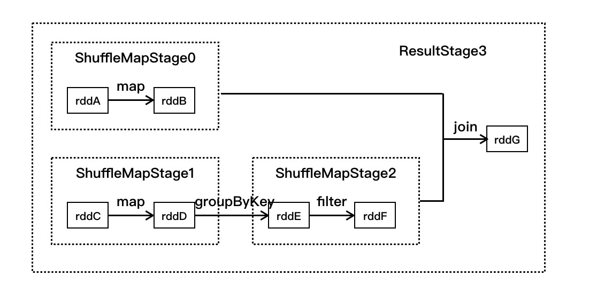
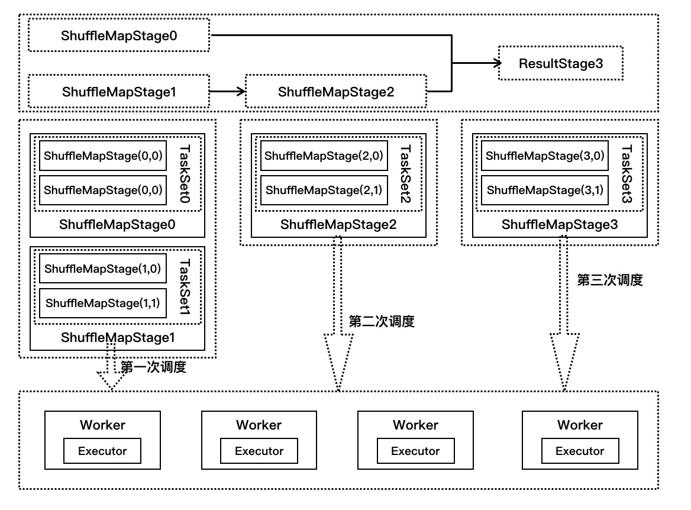
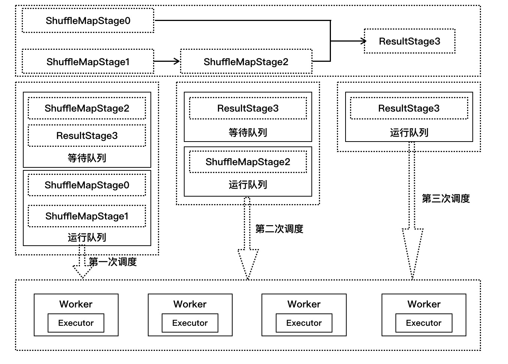

# 目录

* [作业执行源码分析](#作业执行源码分析)
    * [提交作业](#提交作业)
    * [划分调度阶段](#划分调度阶段)
    * [提交调度阶段](#提交调度阶段)
    * [提交任务](#提交任务)
    * [执行任务](#执行任务)
    * [获取执行结果](#获取执行结果)
    

# 作业执行源码分析
当我们的代码执行到了 action（行动）操作之后就会触发作业运行。在 Spark 调度中最重要的是 DAGScheduler 和 TaskScheduler 两个调度器，其中，DAGScheduler 负责任务的逻辑调度，
将作业拆分为不同阶段的具有依赖关系的任务集。TaskScheduler 则负责具体任务的调度执行。
## 提交作业
`WordCount.scala`执行到`wordSort.collect()`才会触发作业执行，在 RDD 的源码的 collect 方法触发了 SparkContext 的 runJob 方法来提交作业。SparkContext 的 runJob 方法经过几次调用后，
进入 DAGScheduler 的 runJob 方法，其中 SparkContext 中调用 DAGScheduler 类 runJob 方法代码如下：

``` scala
def runJob[T, U: ClassTag](rdd: RDD[T],func: (TaskContext, Iterator[T]) => U,partitions: Seq[Int],
      resultHandler: (Int, U) => Unit): Unit = {
    if (stopped.get()) {
      throw new IllegalStateException("SparkContext has been shutdown")
    }
    val callSite = getCallSite
    val cleanedFunc = clean(func)
    ...
    // 调用 DAGScheduler 的 runJob 进行处理
    dagScheduler.runJob(rdd, cleanedFunc, partitions, callSite, resultHandler, localProperties.get)
    progressBar.foreach(_.finishAll())
    // 做 checkpoint，以后再说
    rdd.doCheckpoint()
  }
```

在 DAGScheduler 类内部会进行一列的方法调用，首先是在 runJob 方法里，调用 submitJob 方法来继续提交作业，这里会发生阻塞，直到返回作业完成或失败的结果；然后在 submitJob 方法里，创建了一个 JobWaiter 对象，
并借助内部消息处理进行把这个对象发送给 DAGScheduler 的内嵌类 DAGSchedulerEventProcessLoop 进行处理；最后在 DAGSchedulerEventProcessLoop 消息接收方法 OnReceive 中，接收到 JobSubmitted 样例类完成模式匹配后，
继续调用 DAGScheduler 的 handleJobSubmitted 方法来提交作业，在该方法中进行划分阶段。

``` scala
def submitJob[T, U](rdd: RDD[T],func: (TaskContext, Iterator[T]) => U,partitions: Seq[Int],
      callSite: CallSite,
      resultHandler: (Int, U) => Unit,
      properties: Properties): JobWaiter[U] = {
    // Check to make sure we are not launching a task on a partition that does not exist.
    val maxPartitions = rdd.partitions.length
    partitions.find(p => p >= maxPartitions || p < 0).foreach { p =>
      throw new IllegalArgumentException(
        "Attempting to access a non-existent partition: " + p + ". " +
          "Total number of partitions: " + maxPartitions)
    }

    val jobId = nextJobId.getAndIncrement()
    if (partitions.size == 0) {
      // Return immediately if the job is running 0 tasks
      return new JobWaiter[U](this, jobId, 0, resultHandler)
    }

    val func2 = func.asInstanceOf[(TaskContext, Iterator[_]) => _]
    val waiter = new JobWaiter(this, jobId, partitions.size, resultHandler)
    eventProcessLoop.post(JobSubmitted(
      jobId, rdd, func2, partitions.toArray, callSite, waiter,
      SerializationUtils.clone(properties)))
    waiter
  }
```

## 划分调度阶段
Spark 调度阶段的划分是由 DAGScheduler 实现的，DAGScheduler 会从最后一个 RDD 出发使用广度优先遍历整个依赖树，从而划分调度阶段，
调度阶段的划分是以是否为宽依赖进行的，即当某个 RDD 的操作是 Shuffle 时，以该 Shuffle 操作为界限划分成前后两个调度阶段
代码实现是在 DAGScheduler 的 handleJobSubmitted 方法中。

``` scala
private[scheduler] def handleJobSubmitted(jobId: Int,finalRDD: RDD[_],func: (TaskContext, Iterator[_]) => _,partitions: Array[Int],
      callSite: CallSite,
      listener: JobListener,
      properties: Properties) {
    // 第一步：使用最后一个 RDD 创建一个 finalStage
    var finalStage: ResultStage = null
    try {
      // 创建一个 stage，并将它加入 DAGScheduler 内部的内存缓冲中, newResultStage 的时候就已经得到了他所有的 ParentStage
      finalStage = newResultStage(finalRDD, func, partitions, jobId, callSite)
    } catch {...}

    // 第二步：用 finalStage，创建一个 Job
    val job = new ActiveJob(jobId, finalStage, callSite, listener, properties)
    clearCacheLocs()
    logInfo("Got job %s (%s) with %d output partitions".format(
      job.jobId, callSite.shortForm, partitions.length))
    logInfo("Final stage: " + finalStage + " (" + finalStage.name + ")")
    logInfo("Parents of final stage: " + finalStage.parents)
    logInfo("Missing parents: " + getMissingParentStages(finalStage))

    // 第三步：将 job 加入内存缓存中
    val jobSubmissionTime = clock.getTimeMillis()
    jobIdToActiveJob(jobId) = job
    activeJobs += job
    finalStage.setActiveJob(job)
    val stageIds = jobIdToStageIds(jobId).toArray
    val stageInfos = stageIds.flatMap(id => stageIdToStage.get(id).map(_.latestInfo))
    listenerBus.post(
      SparkListenerJobStart(job.jobId, jobSubmissionTime, stageInfos, properties))
    // 第四步：使用 submitStage 方法来提交最后一个 stage，
    // 最后的结果就是，第一个 stage 提交，其它 stage 都在等待队列中
    submitStage(finalStage)

    // 提交等待的 stage
    submitWaitingStages()
  }
  
// newResultStage 会调用 getParentStagesAndId 得到所有的父类 stage 以及它们的 id
private def newResultStage(rdd: RDD[_],func: (TaskContext, Iterator[_]) => _,partitions: Array[Int],
      jobId: Int,
      callSite: CallSite): ResultStage = {
    // 得到所有的父 stage
    val (parentStages: List[Stage], id: Int) = getParentStagesAndId(rdd, jobId)
    val stage = new ResultStage(id, rdd, func, partitions, parentStages, jobId, callSite)
    stageIdToStage(id) = stage
    updateJobIdStageIdMaps(jobId, stage)
    stage
  }

// 继续调用getParentStages
private def getParentStagesAndId(rdd: RDD[_], firstJobId: Int): (List[Stage], Int) = {
    val parentStages = getParentStages(rdd, firstJobId)
    val id = nextStageId.getAndIncrement()
    (parentStages, id)
  }

private def getParentStages(rdd: RDD[_], firstJobId: Int): List[Stage] = {
    val parents = new HashSet[Stage]
    val visited = new HashSet[RDD[_]]
    // We are manually maintaining a stack here to prevent StackOverflowError
    // caused by recursively visiting
    val waitingForVisit = new Stack[RDD[_]]
    def visit(r: RDD[_]) {
      if (!visited(r)) {
        visited += r
        for (dep <- r.dependencies) {
          dep match {
            // 所依赖 RDD 操作类型是 ShuffleDependency，需要划分 ShuffleMap 调度阶段，
            // 以getShuffleMapStage方法为入口，向前遍历划分调度阶段
            case shufDep: ShuffleDependency[_, _, _] =>
              parents += getShuffleMapStage(shufDep, firstJobId)
            case _ =>
              waitingForVisit.push(dep.rdd)
          }
        }
      }
    }
    // 从最后一个 RDD 向前遍历这个依赖树，如果该 RDD 依赖树存在 ShuffleDependency 的 RDD，
    // 则存在父调度阶段，反之，不存在
    waitingForVisit.push(rdd)
    while (waitingForVisit.nonEmpty) {
      visit(waitingForVisit.pop())
    }
    parents.toList
  }

// 
private def getShuffleMapStage(shuffleDep: ShuffleDependency[_, _, _],firstJobId: Int): ShuffleMapStage = {
    shuffleToMapStage.get(shuffleDep.shuffleId) match {
      case Some(stage) => stage
      case None =>
        // We are going to register ancestor shuffle dependencies
        getAncestorShuffleDependencies(shuffleDep.rdd).foreach { dep =>
          if (!shuffleToMapStage.contains(dep.shuffleId)) {
            // 如果 shuffleToMapStage 中没有，那么就 new 一个 shuffleMapStage
            shuffleToMapStage(dep.shuffleId) = newOrUsedShuffleStage(dep, firstJobId)
          }
        }
        // Then register current shuffleDep
        val stage = newOrUsedShuffleStage(shuffleDep, firstJobId)
        shuffleToMapStage(shuffleDep.shuffleId) = stage
        stage
    }
  }

// 可以对比这个算法和 getParentStages，该方法返回所有的宽依赖
private def getAncestorShuffleDependencies(rdd: RDD[_]): Stack[ShuffleDependency[_, _, _]] = {
    val parents = new Stack[ShuffleDependency[_, _, _]]
    val visited = new HashSet[RDD[_]]

    val waitingForVisit = new Stack[RDD[_]]
    def visit(r: RDD[_]) {
      if (!visited(r)) {
        visited += r
        for (dep <- r.dependencies) {
          dep match {
            // 所依赖 RDD 操作类型是 ShuffleDependency，作为划分 ShuffleMap 调度阶段界限
            case shufDep: ShuffleDependency[_, _, _] =>
              if (!shuffleToMapStage.contains(shufDep.shuffleId)) {
                parents.push(shufDep)
              }
            case _ =>
          }
          waitingForVisit.push(dep.rdd)
        }
      }
    }
    waitingForVisit.push(rdd)
    while (waitingForVisit.nonEmpty) {
      visit(waitingForVisit.pop())
    }
    parents
  }
```

只看代码还是会头大，我们结合一个图来讲解上面的代码：如下图，有 7 个 RDD，分别是 rddA~rddG，它们之间有 5 个操作，其划分调度阶段如下：  
<div align=center>
    
</div>

1. 在 SparkContext 中提交运行时，会调用 DAGScheduler 的 handleJobSubmitted 进行处理，在该方法中会先找到最后一个 RDD(即 rddG)，并调用 getParentStages 方法
2. 在 getParentStages 方法判断 rddG 的依赖 RDD 树中是否存在 shuffle 操作，在该例子中发现 join 操作为 shuffle 操作，则获取该操作的 RDD 为 rddB 和 rddF
3. 使用 getAncestorShuffleDependencies 方法从 rddB 向前遍历，发现该依赖分支上没有其他的宽依赖，调用 newOrUsedShuffleStage 方法生成调度阶段 ShuffleMapStage0
4. 使用 getAncestorShuffleDependencies 方法从 rddF 向前遍历，发现 groupByKey 宽依赖操作，以此为分界划分 rddC 和 rddD 为 ShuffleMapStage1, rddE 和 rddF 为 ShuffleMapStage2
5. 最后生成 rddG 的 ResultStage3。

> 总结，语句`finalStage = newResultStage(finalRDD, func, partitions, jobId, callSite)`在生成 finalStage 的同时，建立起所有调度阶段的依赖关系，最后通过 finalStage 生成一个作业实例，在该作业实例中按照顺序提交调度阶段进行执行。

## 提交调度阶段
通过 handleJobSubmitted 方法中的`submitStage(finalStage)`来提交作业。在 submitStage 方法中调用`getMissingParentStages`方法获取 finalStage 父调度阶段，如果不存在父调度阶段，则使用`submitMissingTasks`方法提交执行，如果存在父调度阶段，
则把该调度阶段存放到 waitingStages 列表中，同时递归调用 submitStage。

``` scala
/**
    * 提交 stage 的方法
    * stage 划分算法的入口，stage 划分算法是由 submitStage() 与 getMissingParentStages() 共同组成
    */
  private def submitStage(stage: Stage) {
    val jobId = activeJobForStage(stage)
    if (jobId.isDefined) {
      logDebug("submitStage(" + stage + ")")
      if (!waitingStages(stage) && !runningStages(stage) && !failedStages(stage)) {
        // getMissingParentStages 获取当前 stage 的父 stage
        val missing = getMissingParentStages(stage).sortBy(_.id)
        logDebug("missing: " + missing)
        // 直到最初的 stage，它没有父 stage，那么此时，就会去首先提交第一个 stage，stage0
        // 其余的 stage，都在 waitingStages 里
        if (missing.isEmpty) {
          logInfo("Submitting " + stage + " (" + stage.rdd + "), which has no missing parents")
          submitMissingTasks(stage, jobId.get)
        } else {
          for (parent <- missing) {
            // 递归调用 submitStage 方法去提交父 stage
            submitStage(parent)
          }
          // 并且当前 stage 放入 waitingStages 等待执行的 stage 队列中
          waitingStages += stage
        }
      }
    } else {
      abortStage(stage, "No active job for stage " + stage.id, None)
    }
  }
  
private def getMissingParentStages(stage: Stage): List[Stage] = {
    val missing = new HashSet[Stage]
    val visited = new HashSet[RDD[_]]
    // We are manually maintaining a stack here to prevent StackOverflowError
    // caused by recursively visiting
    val waitingForVisit = new Stack[RDD[_]]
    
    def visit(rdd: RDD[_]) {
      if (!visited(rdd)) {
        visited += rdd
        val rddHasUncachedPartitions = getCacheLocs(rdd).contains(Nil)
        if (rddHasUncachedPartitions) {
          // rdd 的依赖
          for (dep <- rdd.dependencies) {
            dep match {
              // 如果是宽依赖，那么就创建一个 shuffleMapStage
              case shufDep: ShuffleDependency[_, _, _] =>
                val mapStage = getShuffleMapStage(shufDep, stage.firstJobId)
                // 判断是否可用，也就是判断父 stage 有没有结果, 看源码可以发现就是判断 _numAvailableOutputs == numPartitions
                // _numAvailableOutputs 就是每个 task 成功后会+1
                if (!mapStage.isAvailable) { 
                  missing += mapStage
                }
              // 如果是窄依赖，那么将依赖的 rdd 放入栈中
              case narrowDep: NarrowDependency[_] =>
                waitingForVisit.push(narrowDep.rdd)
            }
          }
        }
      }
    }
    // 首先往栈中推入了 stage 最后一个 rdd
    waitingForVisit.push(stage.rdd)
    while (waitingForVisit.nonEmpty) {
      visit(waitingForVisit.pop())
    }
    missing.toList
  }
```
同样的，我们画图来讲解提交调度阶段，如下图
<div>
    
</div>

## 提交任务
在 submitStage 中会执行 submitMissingTasks 方法中，会根据调度阶段 partition 个数生成对应个数 task，这些任务组成一个任务集提交到 TaskScheduler 进行处理。
对于 ResultStage 生成 ResultTask，对于 ShuffleMapStage 生成 ShuffleMapTask。

``` scala
private def submitMissingTasks(stage: Stage, jobId: Int) {
    ...
    // 为 stage 创建指定数量的 task
    // 这里有一个很关键，就是 task 最佳位置的计算
    val tasks: Seq[Task[_]] = try {
      stage match {
        case stage: ShuffleMapStage =>
          partitionsToCompute.map { id =>
            // 给每个 partition 创建一个 task
            // 给每个 task 计算最佳位置
            val locs = taskIdToLocations(id)
            val part = stage.rdd.partitions(id)
            new ShuffleMapTask(stage.id, stage.latestInfo.attemptId,
              taskBinary, part, locs, stage.latestInfo.taskMetrics, properties)
          }

        case stage: ResultStage =>
          val job = stage.activeJob.get
          partitionsToCompute.map { id =>
            val p: Int = stage.partitions(id)
            val part = stage.rdd.partitions(p)
            val locs = taskIdToLocations(id)
            new ResultTask(stage.id, stage.latestInfo.attemptId,
              taskBinary, part, locs, id, properties, stage.latestInfo.taskMetrics)
          }
      }
    } catch {...}

    if (tasks.size > 0) {
      logInfo("Submitting " + tasks.size + " missing tasks from " + stage + " (" + stage.rdd + ")")
      stage.pendingPartitions ++= tasks.map(_.partitionId)
      logDebug("New pending partitions: " + stage.pendingPartitions)
      // 提交 taskSet,Standalone 模式，使用的是 TaskSchedulerImpl
      taskScheduler.submitTasks(new TaskSet(
        tasks.toArray, stage.id, stage.latestInfo.attemptId, jobId, properties))
      stage.latestInfo.submissionTime = Some(clock.getTimeMillis())
    } else {
      // Because we posted SparkListenerStageSubmitted earlier, we should mark
      // the stage as completed here in case there are no tasks to run
      // 如果调度阶段不存在任务标记，则标记调度阶段已经完成
      markStageAsFinished(stage, None)
      ...
    }
}
```

当 TaskSchedulerImpl 收到发送过来的任务集时，在 submitTasks 方法中构建一个 TaskSetManager 的实例，用于管理这个任务集的生命周期，而该 TaskSetManager 会放入系统的调度池中，根据系统设置的调度算法进行调度，
`TaskSchedulerImpl.submitTasks`方法代码如下：

``` scala
override def submitTasks(taskSet: TaskSet) {
    val tasks = taskSet.tasks
    logInfo("Adding task set " + taskSet.id + " with " + tasks.length + " tasks")
    this.synchronized {
      // 为每一个 taskSet 创建一个 taskSetManager
      // taskSetManager 在后面负责，TaskSet 的任务执行状况的监视和管理
      val manager = createTaskSetManager(taskSet, maxTaskFailures)
      val stage = taskSet.stageId
      val stageTaskSets =
        taskSetsByStageIdAndAttempt.getOrElseUpdate(stage, new HashMap[Int, TaskSetManager])
      // 把 manager 加入内存缓存中
      stageTaskSets(taskSet.stageAttemptId) = manager
      val conflictingTaskSet = stageTaskSets.exists { case (_, ts) =>
        ts.taskSet != taskSet && !ts.isZombie
      }
      if (conflictingTaskSet) {
        throw new IllegalStateException(s"more than one active taskSet for stage $stage:" +
          s" ${stageTaskSets.toSeq.map{_._2.taskSet.id}.mkString(",")}")
      }
      // 将该任务集的管理器加入到系统调度池中，由系统统一调配，该调度器属于应用级别
      // 支持 FIFO 和 FAIR 两种，默认 FIFO
      schedulableBuilder.addTaskSetManager(manager, manager.taskSet.properties)
      ...
    }
    // 在创建 SparkContext，创建 TaskScheduler 的时候，创建了 StandaloneSchedulerBackend，这个 backend 是负责
    // 创建 AppClient，向 Master 注册 Application 的, 详见 Spark运行时消息通信
    backend.reviveOffers()
  }
```

StandaloneSchedulerBackend 的 reviveOffers 方法是继承于父类 CoarseGrainedSchedulerBackend，该方法会向 DriverEndpoint 发送消息，调用 makeOffers 方法。在该方法中先会获取集群中可用的 Executor，
然后发送到 TaskSchedulerImpl 中进行对任务集的任务分配运行资源，最后提交到 launchTasks 方法中。`CoarseGrainedSchedulerBackend.DriverEndpoint.makeOffers`代码如下：

``` scala
private def makeOffers() {
  // 获取集群中可用的 Executor 列表
  val activeExecutors = executorDataMap.filterKeys(executorIsAlive)
  // workOffers是每个Executor可用的cpu资源数量
  val workOffers = activeExecutors.map { case (id, executorData) =>
    new WorkerOffer(id, executorData.executorHost, executorData.freeCores)
  }.toSeq
  // 第一步：调用 TaskSchedulerImpl 的 resourceOffers() 方法，执行任务分配算法，将各个 task 分配到 executor 上去
  // 第二步：分配好 task 到 executor 之后，执行自己的 launchTasks 方法，将分配的 task 发送 LaunchTask 消息到对应 executor 上去，由 executor 启动并执行
  launchTasks(scheduler.resourceOffers(workOffers))
}
```

第一步：在 TaskSchedulerImpl 的 resourceOffers() 方法里进行非常重要的步骤－－资源分配, 在分配过程中会根据调度策略对 TaskSetMannager 进行排序，
然后依次对这些 TaskSetManager 按照就近原则分配资源，按照顺序为PROCESS_LOCAL NODE_LOCAL NO_PREF RACK_LOCAL ANY

``` scala
def resourceOffers(offers: Seq[WorkerOffer]): Seq[Seq[TaskDescription]] = synchronized {
    // Mark each slave as alive and remember its hostname
    // Also track if new executor is added
    var newExecAvail = false
    for (o <- offers) {
      executorIdToHost(o.executorId) = o.host
      executorIdToTaskCount.getOrElseUpdate(o.executorId, 0)
      if (!executorsByHost.contains(o.host)) {
        executorsByHost(o.host) = new HashSet[String]()
        executorAdded(o.executorId, o.host)
        newExecAvail = true
      }
      for (rack <- getRackForHost(o.host)) {
        hostsByRack.getOrElseUpdate(rack, new HashSet[String]()) += o.host
      }
    }

    // 首先，将可用的 executor 进行 shuffle
    val shuffledOffers = Random.shuffle(offers)
    // tasks，是一个序列，其中的每个元素又是一个 ArrayBuffer
    // 并且每个子 ArrayBuffer 的数量是固定的，也就是这个 executor 可用的 cpu 数量
    val tasks = shuffledOffers.map(o => new ArrayBuffer[TaskDescription](o.cores))
    val availableCpus = shuffledOffers.map(o => o.cores).toArray
    // 从 rootPool 中取出排序了的 TaskSetManager
    // 在创建完 TaskScheduler StandaloneSchedulerBackend 之后，会执行 initialize() 方法，其实会创建一个调度池
    // 这里就是所有提交的 TaskSetManager，首先会放入这个调度池中，然后再执行 task 分配算法的时候，会从这个调度池中，取出排好队的 TaskSetManager
    val sortedTaskSets = rootPool.getSortedTaskSetQueue
    // 如果有新加入的 Executor，需要重新计算数据本地性
    for (taskSet <- sortedTaskSets) {
      logDebug("parentName: %s, name: %s, runningTasks: %s".format(
        taskSet.parent.name, taskSet.name, taskSet.runningTasks))
      if (newExecAvail) {
        taskSet.executorAdded()
      }
    }

    // Take each TaskSet in our scheduling order, and then offer it each node in increasing order
    // of locality levels so that it gets a chance to launch local tasks on all of them.
    // NOTE: the preferredLocality order: PROCESS_LOCAL, NODE_LOCAL, NO_PREF, RACK_LOCAL, ANY
    var launchedTask = false
    for (taskSet <- sortedTaskSets; maxLocality <- taskSet.myLocalityLevels) {
      do {
        // 对当前 taskset 尝试使用最小本地化级别，将 taskset 的 task，在 executor 上进行启动
        // 如果启动不了，就跳出这个 do while，进入下一级本地化级别，一次类推
        launchedTask = resourceOfferSingleTaskSet(
            taskSet, maxLocality, shuffledOffers, availableCpus, tasks)
      } while (launchedTask)
    }

    if (tasks.size > 0) {
      hasLaunchedTask = true
    }
    return tasks
  }
```

第二步：分配好资源的任务提交到 CoarseGrainedSchedulerBackend 的 launchTasks 方法中，在该方法中会把任务一个个发送到 Worker 节点上的 CoarseGrainedExecutorBacken，
然后通过其内部的 Executor 来执行任务

``` scala
// 根据分配好的 tasks，在 executor 上启动相应的 task
private def launchTasks(tasks: Seq[Seq[TaskDescription]]) {
  for (task <- tasks.flatten) {
    // 序列化
    val serializedTask = ser.serialize(task)
    if (serializedTask.limit >= maxRpcMessageSize) {
      scheduler.taskIdToTaskSetManager.get(task.taskId).foreach { taskSetMgr =>
        try {
          var msg = ...
          taskSetMgr.abort(msg)
        } catch {
          case e: Exception => logError("Exception in error callback", e)
        }
      }
    } else {
      val executorData = executorDataMap(task.executorId)
      executorData.freeCores -= scheduler.CPUS_PER_TASK
      // 向Worker节点的CoarseGrainedExecutorBackend发送消息执行Task
      executorData.executorEndpoint.send(LaunchTask(new SerializableBuffer(serializedTask)))
    }
  }
}
```

我们继续通过图解来解释以上代码的调用过程，如下图所示：
<div align=center>
    
</div>

1. 在提交 stage 中，第一次调用的是 ShuffleMapStage0 和 ShuffleMapStage1，假设都只有两个 partition，ShuffleMapStage0 是 TaskSet0，
ShuffleMapStage1 是 TaskSet1，每个 TaskSet 都有两个任务在执行。
2. TaskScheduler 收到发送过来的任务集 TaskSet0 和 TaskSet1，在 submitTasks 方法中分别构建 TaskSetManager0 和 TaskSetManager1，并把它们两放到系统的调度池，
根据系统设置的调度算法进行调度（FIFO 或者 FAIR）
3. 在 TaskSchedulerImpl 的 resourceOffers 方法中按照就近原则进行资源分配，使用 CoarseGrainedSchedulerBackend 的 launchTasks 方法把任务发送到 Worker 节点上的 
CoarseGrainedExecutorBackend 调用其 Executor 来执行任务
4. 当 ShuffleMapStage2 同理，ResultStage3 生成的是 ResultTask

## 执行任务
当 CoarseGrainedExecutorBackend 接收到 LaunchTask 消息时，会调用 Executor 的 launchTask 方法进行处理。在 Executor 的 launchTask 方法中，初始化一个 TaskRunner 来封装任务，
它用于管理任务运行时的细节，再把 TaskRunner 对象放入到 ThreadPool 中去执行。`TaskRunner.run`的前半部分代码如下：

``` scala
override def run(): Unit = {
  val taskMemoryManager = new TaskMemoryManager(env.memoryManager, taskId)
  val deserializeStartTime = System.currentTimeMillis()
  // 设置当前类加载器，使用类加载器的原因，用反射的方式来动态加载一个类，然后创建这个类的对象
  Thread.currentThread.setContextClassLoader(replClassLoader)
  val ser = env.closureSerializer.newInstance()
  logInfo(s"Running $taskName (TID $taskId)")
  // 向DriverEndpoint发送状态更新信息
  execBackend.statusUpdate(taskId, TaskState.RUNNING, EMPTY_BYTE_BUFFER)
  var taskStart: Long = 0
  startGCTime = computeTotalGcTime()

  try {
    // 反序列化
    val (taskFiles, taskJars, taskProps, taskBytes) =
      Task.deserializeWithDependencies(serializedTask)

    // Must be set before updateDependencies() is called, in case fetching dependencies
    // requires access to properties contained within (e.g. for access control).
    Executor.taskDeserializationProps.set(taskProps)

    updateDependencies(taskFiles, taskJars)
    task = ser.deserialize[Task[Any]](taskBytes, Thread.currentThread.getContextClassLoader)
    task.localProperties = taskProps
    task.setTaskMemoryManager(taskMemoryManager)

    // If this task has been killed before we deserialized it, let's quit now. Otherwise,
    // continue executing the task.
    if (killed) {
      throw new TaskKilledException
    }

    logDebug("Task " + taskId + "'s epoch is " + task.epoch)
    env.mapOutputTracker.updateEpoch(task.epoch)

    // Run the actual task and measure its runtime.
    taskStart = System.currentTimeMillis()
    var threwException = true
    // value对于shuffleMapTask来说，其实就是MapStatus，封装了shuffleMapTask计算的数据，输出的位置
    val value = try {
      val res = task.run( // 具体实现在ShuffleMapTask和ResultTask中
        taskAttemptId = taskId,
        attemptNumber = attemptNumber,
        metricsSystem = env.metricsSystem)
      threwException = false
      res
    } finally {...}
    ...
```

对于 ShuffleMapTask, 它的计算结果会写到 BlockManager 之中，最终返回给 DAGScheduler 的是一个 MapStatus。该对象管理了 ShuffleMapTask 的运算结果存储到 BlockManager 里的相关存储信息，而不是计算结果本身，
这些存储信息将会成为下一阶段的任务需要获得的输入数据时的依据。`ShuffleMapTask.runTask`代码如下：

``` scala
override def runTask(context: TaskContext): MapStatus = {
    // 反序列化获取rdd和rdd的依赖
    // 通过broadcast variable拿到rdd的数据
    val deserializeStartTime = System.currentTimeMillis()
    val ser = SparkEnv.get.closureSerializer.newInstance()
    val (rdd, dep) = ser.deserialize[(RDD[_], ShuffleDependency[_, _, _])](
      ByteBuffer.wrap(taskBinary.value), Thread.currentThread.getContextClassLoader)
    _executorDeserializeTime = System.currentTimeMillis() - deserializeStartTime

    var writer: ShuffleWriter[Any, Any] = null
    try {
      // 从shuffleManager中获取shuffleWriter
      val manager = SparkEnv.get.shuffleManager
      writer = manager.getWriter[Any, Any](dep.shuffleHandle, partitionId, context)
      // rdd.iterator传入当前task要处理的哪个partition，执行我们自己定义的算子或者是函数
      // 如果rdd已经cache或者checkpoint，那么直接读取，否则计算，计算结果保存在本地系统的blockmanager中
      writer.write(rdd.iterator(partition, context).asInstanceOf[Iterator[_ <: Product2[Any, Any]]])
      // 返回结果MapStatus，其实就是blockmanager相关信息
      writer.stop(success = true).get
    } catch {...}
```

ResultTask 的 runTask 方法如下，它返回的是 func 函数的计算结果

``` scala
override def runTask(context: TaskContext): U = {
    // Deserialize the RDD and the func using the broadcast variables.
    val deserializeStartTime = System.currentTimeMillis()
    val ser = SparkEnv.get.closureSerializer.newInstance()
    val (rdd, func) = ser.deserialize[(RDD[T], (TaskContext, Iterator[T]) => U)](
      ByteBuffer.wrap(taskBinary.value), Thread.currentThread.getContextClassLoader)
    _executorDeserializeTime = System.currentTimeMillis() - deserializeStartTime

    func(context, rdd.iterator(partition, context))
  }
```
## 获取执行结果

对于 Executor 的计算结果，会根据结果的大小有不同的策略

1. 生成结果大于1GB，直接丢弃，可以通过`spark.driver.maxResultSize`来配置
2. 生成结果大小在\[128MB-200kB, 1GB\], 会把结果以 taskId 为编号存入到 BlockManager 中，然后把编号通过 Netty 发送给 DriverEndpoint，Netty 传输框架最大值和预留空间的差值
3. 生成结果大小在\[0, 128MB－200KB\]，通过 Netty 直接发送到 DriverEndpoint。

具体执行在 TaskRunner 的 run 方法后半部分：  

``` scala
    // 对生成的结果序列化，并将结果放入DirectTaskResult中
    val resultSer = env.serializer.newInstance()
    val beforeSerialization = System.currentTimeMillis()
    val valueBytes = resultSer.serialize(value)
    val afterSerialization = System.currentTimeMillis()

    // Note: accumulator updates must be collected after TaskMetrics is updated
    val accumUpdates = task.collectAccumulatorUpdates()
    val directResult = new DirectTaskResult(valueBytes, accumUpdates)
    val serializedDirectResult = ser.serialize(directResult)
    val resultSize = serializedDirectResult.limit

    // directSend = sending directly back to the driver
    val serializedResult: ByteBuffer = {
      if (maxResultSize > 0 && resultSize > maxResultSize) {
        // 大于1G，直接丢弃
        ser.serialize(new IndirectTaskResult[Any](TaskResultBlockId(taskId), resultSize))
      } else if (resultSize > maxDirectResultSize) {
        val blockId = TaskResultBlockId(taskId)
        env.blockManager.putBytes(
          blockId,
          new ChunkedByteBuffer(serializedDirectResult.duplicate()),
          StorageLevel.MEMORY_AND_DISK_SER)
        // IndirectTaskResult间接结果  
        ser.serialize(new IndirectTaskResult[Any](blockId, resultSize))
      } else {
        // 直接发送
        serializedDirectResult
      }
    }
    // CoraseGrainedExecutorBackend的statusUpdate方法
    execBackend.statusUpdate(taskId, TaskState.FINISHED, serializedResult)
  } catch {...}
```

[返回目录](#目录) 就是本页面的目录 </br> 
[返回开始](./Readme.md) 就是 Spark Core 的 Readme.md

# 参考资料
[图解Spark: 核心技术与案例实战](http://www.cnblogs.com/shishanyuan/)