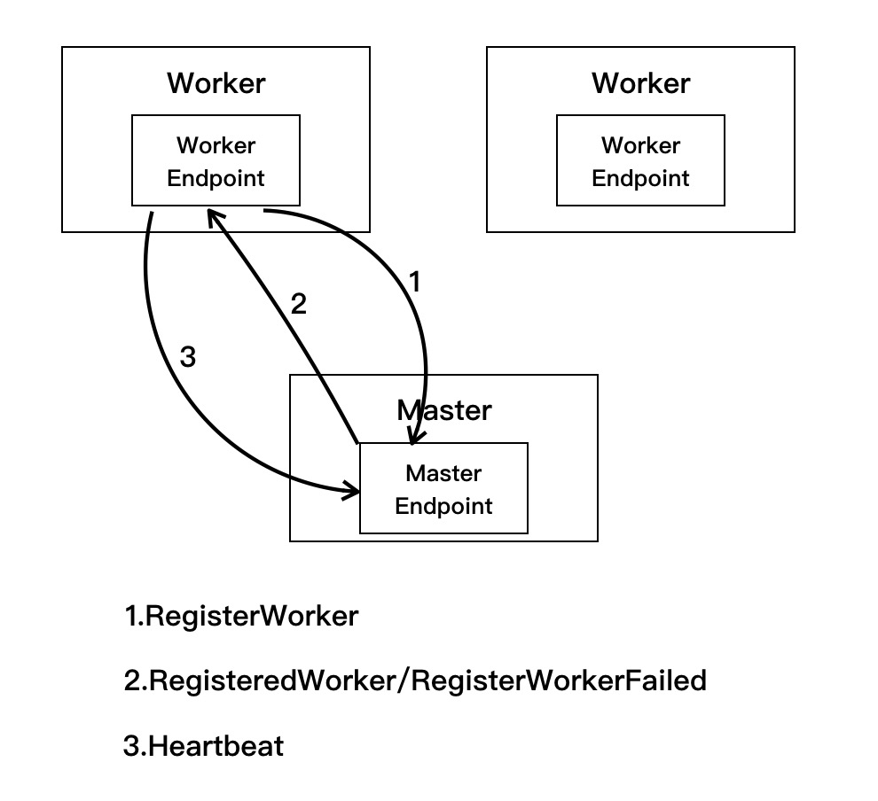
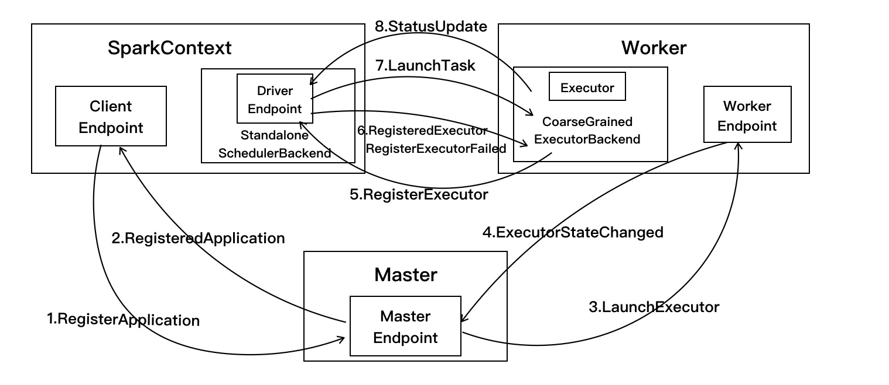
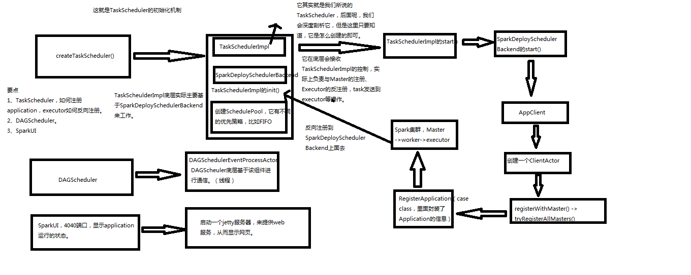

# SparkCore源码分析

# 目录

* [Spark 消息通信](#spark-消息通信)
    * [Spark 启动消息通信](#spark-启动消息通信)
    * [Spark 运行时消息通信](#spark-运行时消息通信)
* [SparkContext 源码分析](#sparkcontext-源码分析)

## Spark 消息通信
 
### Spark 启动消息通信
Spark 启动过程中主要是进行 Master 和 Worker 之间的通信，其消息发送关系如下，首先由 worker 节点向 Master 发送注册消息，然后 Master 处理完毕后，返回注册成功或失败的消息。
<div align=center>
    
</div>
</br>
其详细过程如下：

1. 当 Master 启动后，随之启动各 Worker，Worker 启动时会创建通信环境 RpcEnv 和终端点 EndPoint，并向 Master 发送注册 Worker 的消息`RegisterWorker.Worker.tryRegisterAllMasters`方法如下：

``` scala
// 因为 Master 可能不止一个
private def tryRegisterAllMasters(): Array[JFuture[_]] = {
    masterRpcAddresses.map { masterAddress =>
      registerMasterThreadPool.submit(new Runnable {
        override def run(): Unit = {
          try {
            logInfo("Connecting to master " + masterAddress + "...")
            // 获取 Master 终端点的引用
            val masterEndpoint = rpcEnv.setupEndpointRef(masterAddress, Master.ENDPOINT_NAME)
            registerWithMaster(masterEndpoint)
          } catch {}
        ...    
  }
  
private def registerWithMaster(masterEndpoint: RpcEndpointRef): Unit = {
    // 根据 Master 节点的引用发送注册信息
    masterEndpoint.ask[RegisterWorkerResponse](RegisterWorker(
      workerId, host, port, self, cores, memory, workerWebUiUrl))
      .onComplete {
        // 返回注册成功或失败的结果
        // This is a very fast action so we can use "ThreadUtils.sameThread"
        case Success(msg) =>
          Utils.tryLogNonFatalError {handleRegisterResponse(msg)}
        case Failure(e) =>
          logError(s"Cannot register with master: ${masterEndpoint.address}", e)
          System.exit(1)
      }(ThreadUtils.sameThread)
  }
```

2. Master 收到消息后，需要对 Worker 发送的信息进行验证、记录。如果注册成功，则发送 RegisteredWorker 消息给对应的 Worker，告诉 Worker 已经完成注册，
随之进行步骤3，即 Worker 定期发送心跳给 Master；如果注册过程中失败，则会发送 RegisterWorkerFailed 消息，Woker 打印出错日志并结束 Worker 启动。`Master.receiverAndReply`方法如下：

``` scala
override def receiveAndReply(context: RpcCallContext): PartialFunction[Any, Unit] = {
  case RegisterWorker(
      id, workerHost, workerPort, workerRef, cores, memory, workerWebUiUrl) =>
    logInfo("Registering worker %s:%d with %d cores, %s RAM".format(
      workerHost, workerPort, cores, Utils.megabytesToString(memory)))
    // Master 处于 STANDBY 状态
    if (state == RecoveryState.STANDBY) {
      context.reply(MasterInStandby)
    } else if (idToWorker.contains(id)) { // 在注册列表中发现了该 Worker 节点
      context.reply(RegisterWorkerFailed("Duplicate worker ID"))
    } else {
      val worker = new WorkerInfo(id, workerHost, workerPort, cores, memory,
        workerRef, workerWebUiUrl)
      // registerWorker 方法会把 Worker 放到注册列表中
      if (registerWorker(worker)) {
        persistenceEngine.addWorker(worker)
        context.reply(RegisteredWorker(self, masterWebUiUrl))
        schedule()
      } else {
        val workerAddress = worker.endpoint.address
        logWarning("Worker registration failed. Attempted to re-register worker at same " +
          "address: " + workerAddress)
        context.reply(RegisterWorkerFailed("Attempted to re-register worker at same address: "
          + workerAddress))
      }
    }
   
   ...
}
```

3. 当 Worker 接收到注册成功后，会定时发送心跳信息 Heartbeat 给 Master，以便 Master 了解 Worker 的实时状态。间隔时间可以在`spark.worker.timeout`中设置，注意，该设置值的 1/4 为心跳间隔。

### Spark 运行时消息通信
用户提交应用程序时，应用程序的 SparkContext 会向 Master 发送注册应用信息，并由 Master 给该应用分配 Executor，Executor 启动后会向 SparkContext 发送注册成功消息；当 SparkContext 的 RDD 触发行动操作后，通过 DAGScheduler 进行划分 stage，并将 stage
转化为 TaskSet，接着由 TaskScheduler 向注册的 Executor 发送执行消息，Executor 接收到任务消息后启动并运行；最后当所有任务运行时，由 Driver 处理结果并回收资源。如下图所示：
Spark 启动过程中主要是进行 Master 和 Worker 之间的通信，其消息发送关系如下，首先由 worker 节点向 Master 发送注册消息，然后 Master 处理完毕后，返回注册成功消息或失败消息。
<div align=center>
    
</div>
其详细过程如下：

1. 在 SparkContext 创建过程中会先实例化 SchedulerBackend 对象(standalone 模式中实际创建的是 StandaloneSchedulerBackend 对象)，在该对象启动过程中会继承父类 DriverEndpoint 和创建 StandaloneAppClient 的 ClientEndpoint 两个终端点。  
在 ClientEndpoint 的 tryRegisterAllMasters 方法中创建注册线程池 registerMasterThreadPool, 在该线程池中启动注册线程并向 Master 发送 RegisterApplication 注册应用的消息，代码如下：

``` scala
private def tryRegisterAllMasters(): Array[JFuture[_]] = {
  // 遍历所有的 Master, 这是一个 for 推导式，会构造会一个集合
  for (masterAddress <- masterRpcAddresses) yield {  
    // 在线程池中启动注册线程，当该线程读到应用注册成功标识 registered==true 时退出注册线程
    registerMasterThreadPool.submit(new Runnable {
      override def run(): Unit = try {
        if (registered.get) { // private val registered = new AtomicBoolean(false) 原子类型
          return
        }
        logInfo("Connecting to master " + masterAddress.toSparkURL + "...")
        val masterRef = rpcEnv.setupEndpointRef(masterAddress, Master.ENDPOINT_NAME)
        // 发送注册消息
        masterRef.send(RegisterApplication(appDescription, self))
      } catch {...}
    })
  }
}
```

当 Master 接收到注册应用消息时，在 registerApplication 方法中记录应用信息并把该应用加入到等待运行列表中,发送注册成功消息 
RegisteredApplication 给 ClientEndpoint，同时调用 startExecutorsOnWorkers 方法运行应用。`Master.startExecutorsOnWorkers`方法代码如下：

``` scala
case RegisterApplication(description, driver) =>
  // TODO Prevent repeated registrations from some driver
  if (state == RecoveryState.STANDBY) {
    // ignore, don't send response
  } else {
    logInfo("Registering app " + description.name)
    val app = createApplication(description, driver)
    registerApplication(app)
    logInfo("Registered app " + description.name + " with ID " + app.id)
    // 使用持久化引擎，将 Application 进行持久化
    persistenceEngine.addApplication(app)
    driver.send(RegisteredApplication(app.id, self))
    schedule()
  }  

private def schedule(): Unit = {
    if (state != RecoveryState.ALIVE) {
      return
    }
    // 对 Worker 节点进行随机排序
    val shuffledAliveWorkers = Random.shuffle(workers.toSeq.filter(_.state == WorkerState.ALIVE))
    val numWorkersAlive = shuffledAliveWorkers.size
    var curPos = 0
    // 按照顺序在集群中启动 Driver，Driver 尽量在不同的 Worker 节点上运行
    for (driver <- waitingDrivers.toList) { 
      var launched = false
      var numWorkersVisited = 0
      while (numWorkersVisited < numWorkersAlive && !launched) {
        val worker = shuffledAliveWorkers(curPos)
        numWorkersVisited += 1
        if (worker.memoryFree >= driver.desc.mem && worker.coresFree >= driver.desc.cores) {
          launchDriver(worker, driver)
          waitingDrivers -= driver
          launched = true
        }
        curPos = (curPos + 1) % numWorkersAlive
      }
    }
    startExecutorsOnWorkers()
  }

private def startExecutorsOnWorkers(): Unit = {
    // 使用 FIFO 算法运行应用，即先注册的应用先运行
    for (app <- waitingApps if app.coresLeft > 0) {
      val coresPerExecutor: Option[Int] = app.desc.coresPerExecutor
      // Filter out workers that don't have enough resources to launch an executor
      val usableWorkers = workers.toArray.filter(_.state == WorkerState.ALIVE)
        .filter(worker => worker.memoryFree >= app.desc.memoryPerExecutorMB &&
          worker.coresFree >= coresPerExecutor.getOrElse(1))
        .sortBy(_.coresFree).reverse
      // 一种是 spreadOutApps，就是把应用运行在尽量多的 Worker 上，另一种是非 spreadOutApps
      val assignedCores = scheduleExecutorsOnWorkers(app, usableWorkers, spreadOutApps)

      // Now that we've decided how many cores to allocate on each worker, let's allocate them
      // 给每个 worker 分配完 application 要求的 cpu core 之后，遍历 worker 启动 executor
      for (pos <- 0 until usableWorkers.length if assignedCores(pos) > 0) {
        allocateWorkerResourceToExecutors(
          app, assignedCores(pos), coresPerExecutor, usableWorkers(pos))
      }
    }
  }
  
```


2. StandaloneAppClient.ClientEndpoint 接收到 Master 发送的 RegisteredApplication 消息，需要把注册标识 registered 置为 true 。代码如下：


``` scala
case RegisteredApplication(appId_, masterRef) =>
    appId.set(appId_)
    registered.set(true)
    master = Some(masterRef)
    listener.connected(appId.get)
```

3. 在 Master 类的 starExecutorsOnWorkers 方法中分配资源运行应用程序时，调用 allocateWorkerResourceToExecutors 方法实现在 Worker 中启动 Executor。当 
Worker 收到 Master 发送过来的 LaunchExecutor 消息，先实例化 ExecutorRunner 对象，在 ExecutorRunner 启动中会创建进程生成器 ProcessBuilder, 然后由该生成器使用 command 
创建 CoarseGrainedExecutorBackend 对象，该对象是 Executor 运行的容器，最后 Worker 发送 ExecutorStateChanged 消息给 Master，通知 Executor 容器已经创建完毕。

``` scala
case LaunchExecutor(masterUrl, appId, execId, appDesc, cores_, memory_) =>
  if (masterUrl != activeMasterUrl) {
    logWarning("Invalid Master (" + masterUrl + ") attempted to launch executor.")
  } else {
    try {
      logInfo("Asked to launch executor %s/%d for %s".format(appId, execId, appDesc.name))

      // 创建 executor 执行目录
      val executorDir = new File(workDir, appId + "/" + execId)
      if (!executorDir.mkdirs()) {
        throw new IOException("Failed to create directory " + executorDir)
      }

      // 创建 executor 本地目录，当应用程序结束后由 worker 删除
      val appLocalDirs = appDirectories.getOrElse(appId,
        Utils.getOrCreateLocalRootDirs(conf).map { dir =>
          val appDir = Utils.createDirectory(dir, namePrefix = "executor")
          Utils.chmod700(appDir)
          appDir.getAbsolutePath()
        }.toSeq)
      appDirectories(appId) = appLocalDirs
      
      // 在 ExecutorRunner 中创建 CoarseGrainedExecutorBackend 对象，创建的是使用应用信息中的 command，而 command 在 
      // StandaloneSchedulerBackend 的 start 方法中构建
      val manager = new ExecutorRunner(appId,execId,appDesc.copy(command = Worker.maybeUpdateSSLSettings(appDesc.command, conf)),
        cores_,memory_,self,workerId,host,webUi.boundPort,publicAddress,sparkHome,executorDir,workerUri,conf,
        appLocalDirs, ExecutorState.RUNNING)
      executors(appId + "/" + execId) = manager
      manager.start() // 启动ExecutorRunner
      coresUsed += cores_
      memoryUsed += memory_
      sendToMaster(ExecutorStateChanged(appId, execId, manager.state, None, None))
    } catch {...}
  }
```

在 ExecutorRunner 创建中调用了 fetchAndRunExecutor 方法进行实现，在该方法中 command 内容在 StandaloneSchedulerBackend 中定义，指定构造 Executor 运行容器 CoarseGrainedExecutorBackend，
代码如下：

``` scala
private def fetchAndRunExecutor() {
    try {
      // 通过应用程序信息和环境配置创建构造器 builder
      val builder = CommandUtils.buildProcessBuilder(appDesc.command, new SecurityManager(conf),
        memory, sparkHome.getAbsolutePath, substituteVariables)
      val command = builder.command()
      val formattedCommand = command.asScala.mkString("\"", "\" \"", "\"")
      logInfo(s"Launch command: $formattedCommand")

      // 在构造器 builder 中添加执行目录等信息
      builder.directory(executorDir)
      builder.environment.put("SPARK_EXECUTOR_DIRS", appLocalDirs.mkString(File.pathSeparator))
      builder.environment.put("SPARK_LAUNCH_WITH_SCALA", "0")

      // Add webUI log urls
      val baseUrl =
        s"http://$publicAddress:$webUiPort/logPage/?appId=$appId&executorId=$execId&logType="
      builder.environment.put("SPARK_LOG_URL_STDERR", s"${baseUrl}stderr")
      builder.environment.put("SPARK_LOG_URL_STDOUT", s"${baseUrl}stdout")

      // 启动构造器，创建 CoarseGrainedExecutorBackend 实例
      process = builder.start()
      val header = "Spark Executor Command: %s\n%s\n\n".format(
        formattedCommand, "=" * 40)

      // 输出 CoarseGrainedExecutorBackend 实例运行信息
      val stdout = new File(executorDir, "stdout")
      stdoutAppender = FileAppender(process.getInputStream, stdout, conf)
      val stderr = new File(executorDir, "stderr")
      Files.write(header, stderr, StandardCharsets.UTF_8)
      stderrAppender = FileAppender(process.getErrorStream, stderr, conf)

      // 等待 CoarseGrainedExecutorBackend 运行结束，当结束时向 Worker 发送退出状态信息
      val exitCode = process.waitFor() 
      state = ExecutorState.EXITED
      val message = "Command exited with code " + exitCode
      worker.send(ExecutorStateChanged(appId, execId, state, Some(message), Some(exitCode)))
    } catch {...}
  }
```

4. Master 接收到 Worker 发送的 ExecutorStateChanged 消息，代码如下：

``` scala
case ExecutorStateChanged(appId, execId, state, message, exitStatus) =>
  // 找到 executor 对应的 app，然后 flatMap，通过 app 内部的缓存获取 executor 信息
  val execOption = idToApp.get(appId).flatMap(app => app.executors.get(execId))
  execOption match {
    case Some(exec) =>
      // 设置 executor 的当前状态
      val appInfo = idToApp(appId)
      val oldState = exec.state
      exec.state = state

      if (state == ExecutorState.RUNNING) {
        assert(oldState == ExecutorState.LAUNCHING,
          s"executor $execId state transfer from $oldState to RUNNING is illegal")
        appInfo.resetRetryCount()
      }
      // 向 Driver 发送 ExecutorUpdated 消息
      exec.application.driver.send(ExecutorUpdated(execId, state, message, exitStatus, false))
      ...
```

5. 在 3 中的 CoarseGrainedExecutorBackend 启动方法 onStart 中，会发送注册 Executor 消息 RegisterExecutor 给 DriverEndpoint，DriverEndpoint 先判断该 Executor 是否已经注册，在 makeOffers() 方法
中分配运行任务资源，最后发送 LaunchTask 消息执行任务。

``` scala
case RegisterExecutor(executorId, executorRef, hostname, cores, logUrls) =>
    if (executorDataMap.contains(executorId)) {
      executorRef.send(RegisterExecutorFailed("Duplicate executor ID: " + executorId))
      context.reply(true)
    } else {
      ...
      // 记录 executor 编号以及该 executor 需要使用的核数
      addressToExecutorId(executorAddress) = executorId
      totalCoreCount.addAndGet(cores)
      totalRegisteredExecutors.addAndGet(1)
      val data = new ExecutorData(executorRef, executorRef.address, hostname,
        cores, cores, logUrls)
      // 创建 executor 编号和其具体信息的键值列表
      CoarseGrainedSchedulerBackend.this.synchronized {
        executorDataMap.put(executorId, data)
        if (currentExecutorIdCounter < executorId.toInt) {
          currentExecutorIdCounter = executorId.toInt
        }
        if (numPendingExecutors > 0) {
          numPendingExecutors -= 1
          logDebug(s"Decremented number of pending executors ($numPendingExecutors left)")
        }
      }
      // 回复 Executor 完成注册消息并在监听总线中加入添加 executor 事件
      executorRef.send(RegisteredExecutor)
      context.reply(true)
      listenerBus.post(
        SparkListenerExecutorAdded(System.currentTimeMillis(), executorId, data))
      // 分配运行任务资源并发送 LaunchTask 消息执行任务
      makeOffers()
    }
```

6. CoarseGrainedExecutorBackend 接收到 Executor 注册成功 RegisteredExecutor 消息时，在 CoarseGrainedExecutorBackend 容器中实例化 
Executor 对象。启动完毕后，会定时向 Driver 发送心跳信息, 等待接收从 DriverEndpoint 发送执行任务的消息。CoarseGrainedExecutorBackend 处理注册成功代码如下：

``` scala
// 向 driver 注册成功了，返回 RegisteredExecutor 消息
case RegisteredExecutor =>
  logInfo("Successfully registered with driver")
  try {
    // 新建 Executor, 该 Executor 会定时向 Driver 发送心跳信息，等待 Driver 下发任务
    executor = new Executor(executorId, hostname, env, userClassPath, isLocal = false)
  } catch {...}
```

7. CoarseGrainedExecutorBackend 的 Executor 启动后接收从 DriverEndpoint 发送的 LaunchTask 执行任务消息，任务执行是在 Executor 的 launchTask 方法实现的。在执行时会创建 TaskRunner 进程，由该进程进行任务处理，
处理完毕后发送 StateUpdate 消息返回给 CoarseGrainedExecutorBackend。任务执行和获取结果见后:blush:

``` scala
def launchTask(context: ExecutorBackend,taskId: Long,
      attemptNumber: Int,taskName: String,serializedTask: ByteBuffer): Unit = {
    // 对于每一个 task 创建一个 TaskRunner
    val tr = new TaskRunner(context, taskId = taskId, attemptNumber = attemptNumber, taskName,serializedTask)
    // 将 taskRunner 放入内存缓存
    runningTasks.put(taskId, tr)
    // 将 taskRunner 放入线程池中，会自动排队
    threadPool.execute(tr)
  }
```

8. 在 TaskRunner 执行任务完成时，会向 DriverEndpoint 发送 StatusUpdate 消息，DriverEndpoint 接收到消息会调用 TaskSchedulerImpl 的 statusUpdate 方法，根据任务执行不同的结果处理，处理完毕后再给该 Executor 分配执行任务。代码如下：

``` scala
case StatusUpdate(executorId, taskId, state, data) =>
    // 调用 TaskSchedulerImpl 的 statusUpdate 方法，根据任务执行不同的结果处理
    scheduler.statusUpdate(taskId, state, data.value)
    if (TaskState.isFinished(state)) {
      executorDataMap.get(executorId) match {
        // 任务执行成功后，回收该 Executor 运行该任务的 CPU，再根据实际情况分配任务
        case Some(executorInfo) =>
          executorInfo.freeCores += scheduler.CPUS_PER_TASK
          makeOffers(executorId)
        case None => ...
      }
    }
```

## SparkContext 源码分析
在任何 Spark 程序中，必须要创建一个 SparkContext，在 SparkContext 中，最主要的就是创建了 TaskScheduler 和 DAGScheduler，以及 SparkUI
``` scala
...
// Create and start the scheduler
val (sched, ts) = SparkContext.createTaskScheduler(this, master, deployMode) // 创建 taskScheduler
_schedulerBackend = sched
_taskScheduler = ts
_dagScheduler = new DAGScheduler(this) // 创建DAGScheduler
...

// 在创建 SparkContext 的时候，会执行 val (sched, ts) = SparkContext.createTaskScheduler(this, master, deployMode)
private def createTaskScheduler(
      sc: SparkContext,
      master: String,
      deployMode: String): (SchedulerBackend, TaskScheduler) = {
    import SparkMasterRegex._

    // When running locally, don't try to re-execute tasks on failure.
    val MAX_LOCAL_TASK_FAILURES = 1

    master match { // 匹配 master，我们这里主要以 Standlone 为主，所以，就只看SPARK_REGEX
      ...

      case SPARK_REGEX(sparkUrl) => // Standlone模式
        val scheduler = new TaskSchedulerImpl(sc) // 创建TaskScheduler
        val masterUrls = sparkUrl.split(",").map("spark://" + _)
        // 创建StandaloneSchedulerBackend
        val backend = new StandaloneSchedulerBackend(scheduler, sc, masterUrls) 
        scheduler.initialize(backend) // 初始化 taskScheduler, 主要是赋值 backend 以及根据调度方法创建调度池
        (backend, scheduler)

      ...
    }
  }
```
图解如下(其中的 SparkDeploySchedulerBackend 是1.0的名字，2.0就是 StandaloneSchedulerBackend)：  

<div align=center>
    
</div>


[返回目录](#目录) 就是本页面的目录 </br> 
[返回开始](./Readme.md) 就是Spark Core的Readme.md

# 参考资料
[图解Spark: 核心技术与案例实战](http://www.cnblogs.com/shishanyuan/)