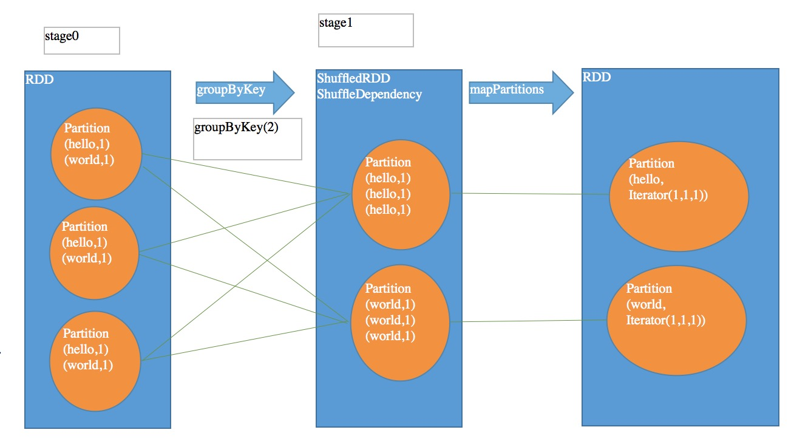
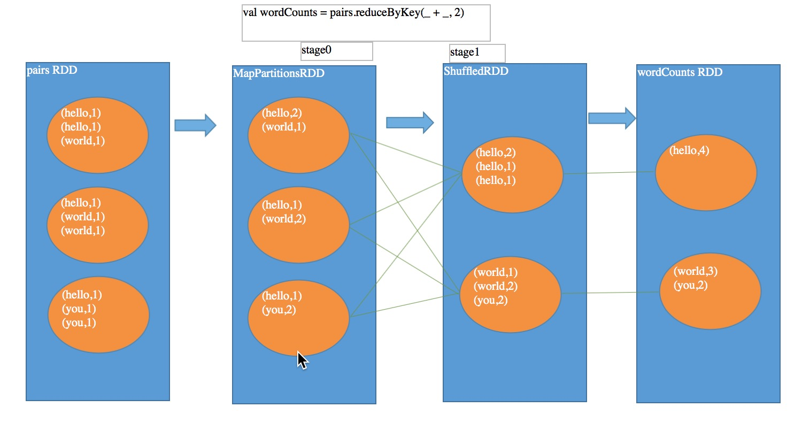
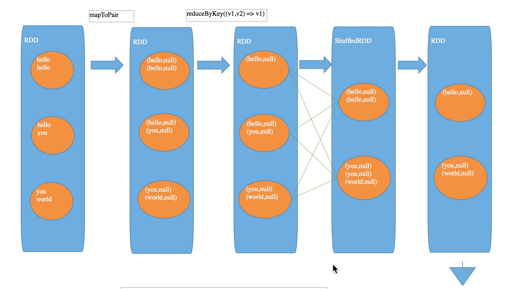
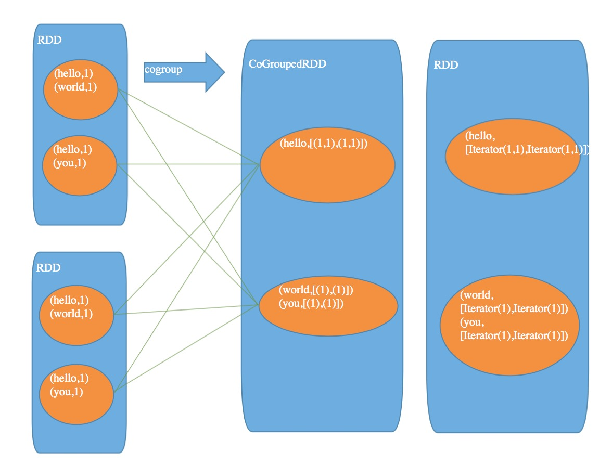
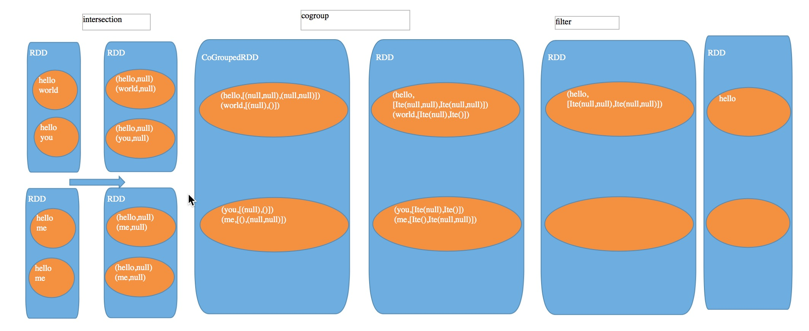
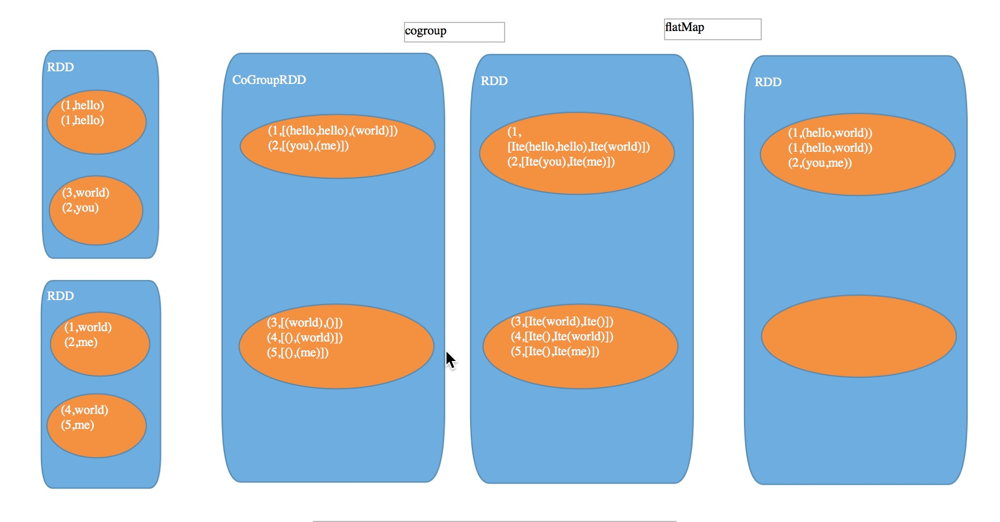
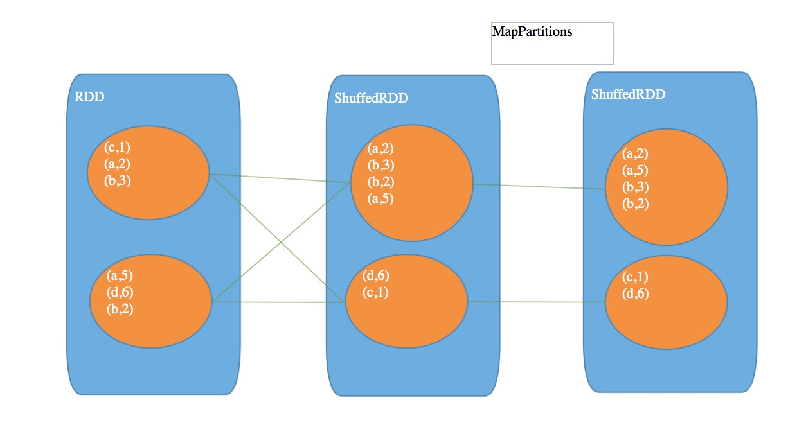
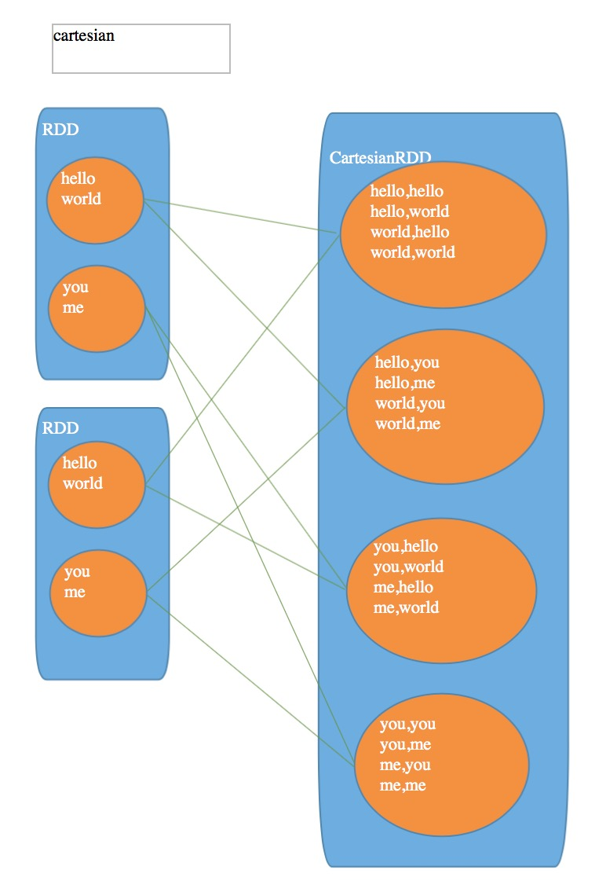
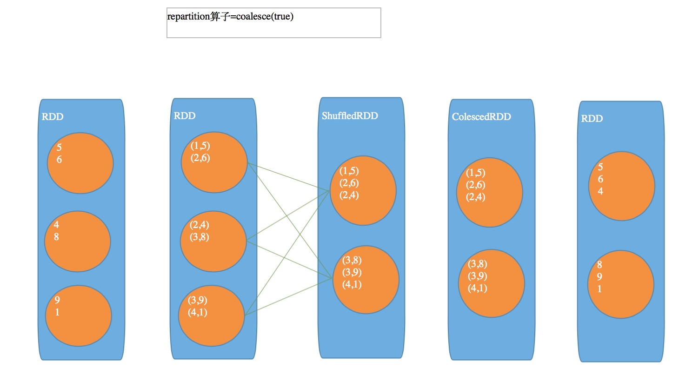

# 目录

* [map mapPartitions mapPartitionWithIndex](#map-vs-mappartitions-vs-mappartitionwithindex)
* [sample和takeSample](#sample-vs-takesample)
* [union](#union)
* [groupByKey](#groupbykey)
* [reduceByKey](#reducebykey)
* [aggregateByKey](#aggregatebykey)
* [combineByKey](#combineByKey)
* [distinct](#distinct)
* [cogroup](#cogroup)
* [intersection](#intersection)
* [join](#join)
* [sortByKey](#sortbykey)
* [cartesian](#cartesian)
* [coalesce和repartition](#coalesce-vs-repartition)


## _map_ vs _mapPartitions_ vs _mapPartitionWithIndex_
map 和 mapPartitions 的区别就是：  
map 一次处理一个 partition 中的一条数据，mapPartitions 一次处理一个 partition 的全部数据  
mapPartitionWithIndex 可以得到每个 partition 的 index，从 0 开始，用法参见 [MapPartitionWithIndex](./MapPartitionWithIndex.scala)

## _sample_ vs _takeSample_
sample 算子就是从数据集中抽取一部分数据，第一个参数是是否有放回抽取数据，第二个参数是抽取的百分比，第三个参数是用来生成随机数的种子, [Sample](./Sample.scala)</br>
takeSample 与 sample 不同之处
> 1. takeSample 是 action 操作，sample 是 transformation 操作
> 2. takeSample 不能指定抽取比例，只能是抽取几个
``` scala
val luckyBoy = staffRDD.takeSample(false, 3)
```

## _union_
union 操作就是把两个 RDD 聚合成一个 RDD，其中是原封不动的把各个 RDD 的 partition 复制到新 RDD 中去
``` scala
val department1StaffList = List("张三", "李四", "王二", "麻子") 
val department1StaffRDD = sc.parallelize(department1StaffList)
        
val department2StaffList = List("赵六", "王五", "小明", "小倩")
val department2StaffRDD = sc.parallelize(department2StaffList)
        
val departmentStaffRDD = department1StaffRDD.union(department2StaffRDD)
```

## _groupByKey_
>groupByKey 等 shuffle 算子，都会创建一些隐式 RDD，主要是作为这个操作的一些中间数据的表达，以及作为 stage 划分的边界。如下图的 shuffleRDD，作为一个 shuffle 过程中的中间数据代表，
依赖这个 shuffleRDD 创建出来一个新的 stage(stage1)，ShuffleRDD 会触发 shuffle read 操作。从上游 stage 的 task 所在节点，拉取过来相同的 key，做进一步聚合。
对 shuffleRDD 中的数据执行一个 map 类操作，主要是对每个 partition 中的数据，都进行一个映射和聚合。这里主要是将每个 key 对应的数据都聚合到一个 Iterator 集合中。
<div align=center>
    
</div>

## _reduceByKey_
reduceByKey 和 groupByKey 异同之处</br>
> 1. 不同之处：reduceByKey ，多了一个 RDD，MapPartitionRDD，存在于 stage0 的，主要是代表了进行本地数据规约之后的 RDD，
所以，网络传输的数据量以及磁盘 I/O 等都会减少，性能更高。</br>
> 2. 相同之处: 后面进行 shuffle read 和聚合的过程基本和 groupByKey 类似。都是 shuffleRDD，去做 shuffle read。然后聚合，
聚合后的数据就是最终的 RDD。</br>
<div align=center>
    
</div>

## _aggregateByKey_
> reduceByKey 可以认为是 aggregateByKey 的简化版
  aggregateByKey 最重要的一点是，多提供了一个函数，Seq Function
  就是说自己可以控制如何对每个 partition 中的数据进行先聚合，类似于 mapreduce 中的，map-side combine
  然后才是对所有 partition 中的数据进行全局聚合</br>
>> * 第一个参数是，每个 key 的初始值
>> * 第二个是个函数，Seq Function，如何进行 shuffle map-side 的本地聚合
>> * 第三个是个函数，Combiner Function，如何进行 shuffle reduce-side 的全局聚合
[AggregateByKey示例代码](./AggregateByKey.scala)

## _combineByKey_
> combineByKey 是对 RDD 中的数据集按照 Key 进行聚合操作。聚合操作的逻辑是通过自定义函数提供给 combineByKey。
  `combineByKey\[C\](createCombiner: (V) => C, mergeValue: (C, V) => C, mergeCombiners: (C, C) => C, numPartitions: Int): RDD\[(K,C)\]`
  把 (K,V) 类型的RDD转换为 (K,C) 类型的 RDD，C 和 V 可以不一样。其中参数解释如下：
>  * createCombiner: 组合器函数，用于将 V 类型转换为 C 类型，输入参数为 RDD\[K,V\] 的 V, 输出为 C
>  * mergeValue: 合并值函数，将一个 C 类型和一个 V 类型合并成一个 C 类型，输入参数为 (C,V)，输出为 C
>  * mergeCombiners: 合并组合起函数，用于将两个 C 类型值合并成一个 C 类型值，输入参数为 (C,C)，输出为 C
>  * numPartitions: 结果 RDD 分区数，默认保持原有的分区数

[combineByKey](./CombineByKey.scala)
``` scala
val data = Array((1, 1.0), (1, 2.0), (1, 3.0), (2, 4.0), (2, 5.0), (2, 6.0))
val rdd = sc.parallelize(data, 2)
val combine1 = rdd.combineByKey(
    createCombiner = (v:Double) => (v:Double, 1),
    mergeValue = (c:(Double, Int), v:Double) => (c._1 + v, c._2 + 1),
    mergeCombiners = (c1:(Double, Int), c2:(Double, Int)) => (c1._1 + c2._1, c1._2 + c2._2),
    numPartitions = 2 )
combine1.foreach(println)

// (2,(15.0,3))
// (1,(6.0,3))
```


## _distinct_
distinct 的原理：</br>
> 1. 首先 map 操作给自己每个值都打上一个 v2，变成一个 tuple</br>
> 2. 然后调用 reduceByKey (仅仅返回一个 value) </br>
> 3. 将去重后的数据，从 tuple 还原为单值</br>
<div align=center>
    
</div>

## _cogroup_
cogroup 的原理：</br>
把多个 RDD 中的数据根据 key 聚合起来
<div align=center>
    
</div>

## _intersection_
intersection 的原理：
> 1. 首先 map 操作变成一个 tuple
> 2. 然后 cogroup 聚合两个 RDD 的 key
> 3. filter, 过滤掉两个集合中任意一个集合为空的 key
> 4. map，还原出单 key
<div align=center>
    
</div>

## _join_
join 算子的原理：
> 1. cogroup, 聚合两个 RDD 的 key
> 2. flatMap, 聚合后,每条数据可能返回多条数据，将每个 key 对应两个集合做了一个笛卡儿积
<div align=center>
    
</div>

## _sortByKey_
sortByKey 的原理：
> 1. shuffleRDD, 做 shuffle read, 将相同的 key 拉到一个 partition 中来
> 2. mapPartition, 对每个 partition 内的 key 进行全局的排序
<div align=center>
    
</div>

## _cartesian_
cartesian 的原理：</br>
<div align=center>
    
</div>

## *coalesce* vs *repartition*
coalesce 的原理：</br>
coalesce 操作使用 HashPartition 进行重分区，第一个参数为重分区的数目，第二个为是否进行 shuffle，默认情况为 false。</br>
repartition 操作是 coalesce 函数第二个参数为 true 的实现
``` scala
var data = sc.textFile("...") // 假设分区数为2
var rdd1 = data.coalesce(1)   // 分区数小于原分区数目，可以正常进行
var rdd2 = data.coalesce(4)   // 如果分区数目大于原来分区数，必须指定shuffle为true，否则分区数不变
// 也就是说coalesce只能用来减少分区
```
repartition 原理如下：</br>
> 1. map, 附加了前缀，根据要重分区成几个分区，计算出前缀
> 2. shuffleRDD -> coalesceRDD
> 3. 去掉前缀
<div align=center>
    
</div>

## 二次排序
spark 的二次排序的意思就是在第一个值相等的情况下，根据第二个值进行排序</br>
一般是要继承 Ordered(和 java 的 comparator 很像)，如下：</br>
``` scala
class SecondSortKey(val first: Int, val second : Int) extends Ordered[SecondSortKey] with Serializable {
    override def compare(that: SecondSortKey): Int = {
        if (this.first - that.first != 0) {
            this.first - that.first
        } else {
            this.second - that.second
        }
    }
}
```
详情参见[SecondSort.scala](./SecondSort.scala)

## 分组取 topN
分组取 topN，就是在每个分组中取最高 N 个数，详见[GroupTop3](./GroupTop3.scala)


[返回目录](#目录) 就是本页面的目录 </br> 
[返回开始](./Readme.md) 就是Spark Core的Readme.md
