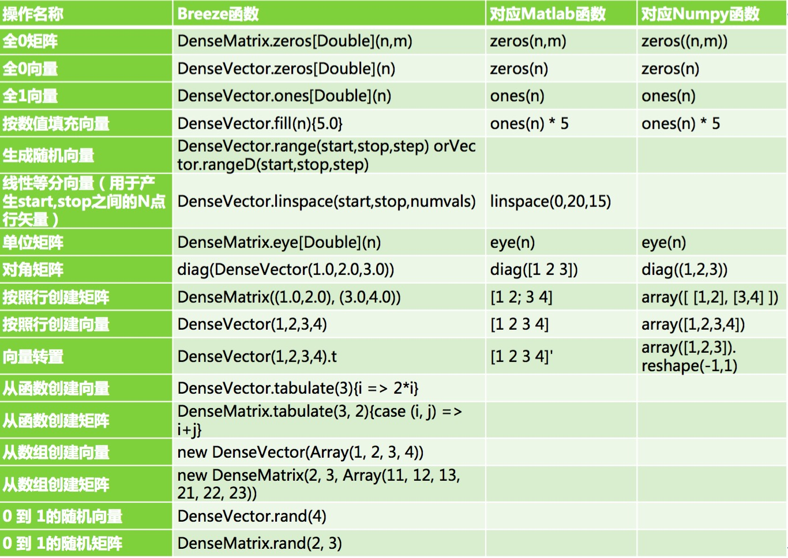
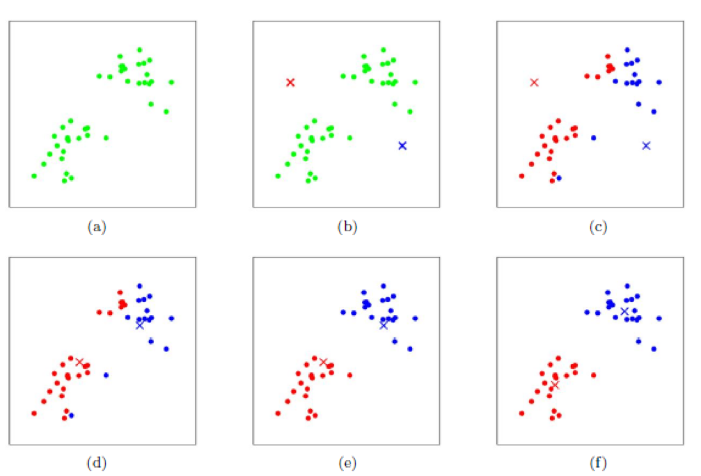

# Spark机器学习笔记


## Spark MLlib矩阵向量
Spark MLlib底层的向量、矩阵运算使用了Breeze库,Breeze库提供了Vector/Matrix的实现以及 相应计算的接口(Linalg)。但是在MLlib里面同时也提供了Vector和Linalg等的实现。  
在使用Breeze 库时,需要导入相关包:  
``` scala
import breeze.linalg._  
import breeze.numerics._
```
### Breeze创建函数
<div align=center>
    
</div>

主要实现代码见[StudyBreeze](./chapter02/StudyBreeze.scala)

## 线性回归


## 逻辑回归


## 朴素贝叶斯


## 决策树


## KMeans

### KMeans算法
KMeans算法的基本思想是初始随机给定K个簇中心，按照最邻近原则把待分类样本点分到各个簇。然后按平均法重新计算各个簇的质心，从而确定新的簇心。一直迭代，直到簇心的移动距离小于某个给定的值。  

主要分为3个步骤
1. 为待聚类的点寻找聚类中心( k 个聚类中心)
2. 计算每个点到聚类中心的距离，将每个点聚类到离该点最近的聚类中去
3. 计算每个聚类中所有点的坐标平均值，并将这个平均值作为新的聚类中心  
反复执行2、3，直到聚类中心不再进行大范围移动或者聚类次数达到要求为止

如下图所示，展示了对n个样本点进行KMeans聚类的效果，这里k取2.
<div align=center>
    
</div>

(a)未聚类的初始点集；  
(b)随机选取两个点作为聚类中心；  
(c)计算每个点到聚类中心的距离，并聚类到离该点最近的聚类中去；  
(d)计算每个聚类中所有点的坐标平均值，并将这个平均值作为新的聚类中心；  
(e)重复(c)，计算每个点到聚类中心的距离，并聚类到离该点最近的聚类中去；  
(f)重复(d)，计算每个聚类中所有点的坐标平均值，并将这个平均值作为新的聚类中心。  


### KMeans++算法
对于 KMeans ，初始的聚类中心点是需要我们指定的，通常我们也是在样本点中随机选择 K 个点作为初始聚类中心点，这样的选择随机性太大。不同的初始聚类中心可能导致完全不同的聚类结果。
所以 KMeans++ 算法就是通过算法来选择初始聚类中心点。初始聚类中心点的算法如下：
1. 从输入的数据点集合中随机选择一个点作为第一个聚类中心；
2. 对于数据集中的每一个点 x ，计算它与最近聚类中心（指已选择的聚类中心）的距离D(x)；
3. 选择一个新的数据点作为新的聚类中心，选择的原则是：D(x) 较大的点，被选取作为聚类中心的概率较大；
4. 重复2和3，直到 k 个聚类中心被选出来；
5. 利用这 k 个初始的聚类中心来运行标准的KMeans 算法。


