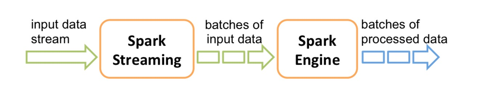
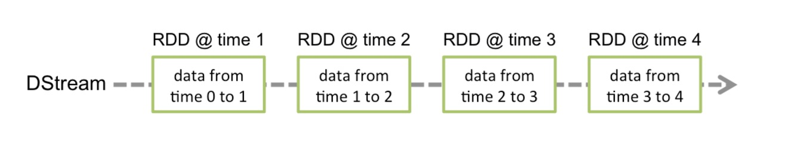
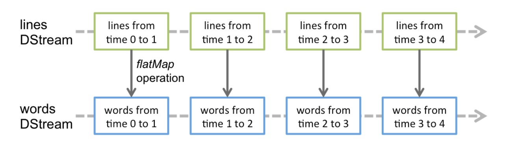
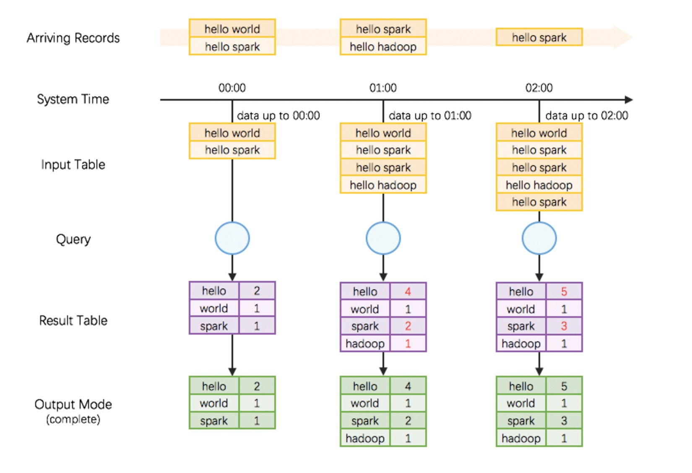
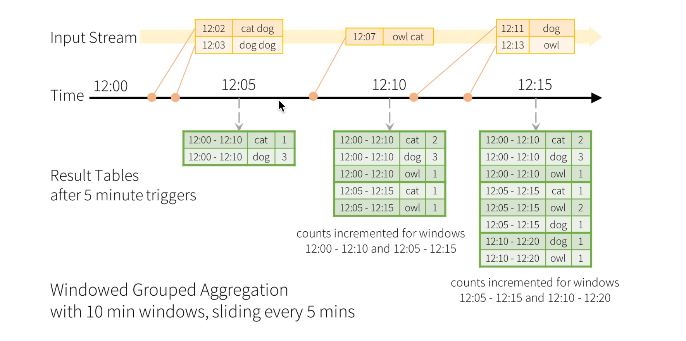
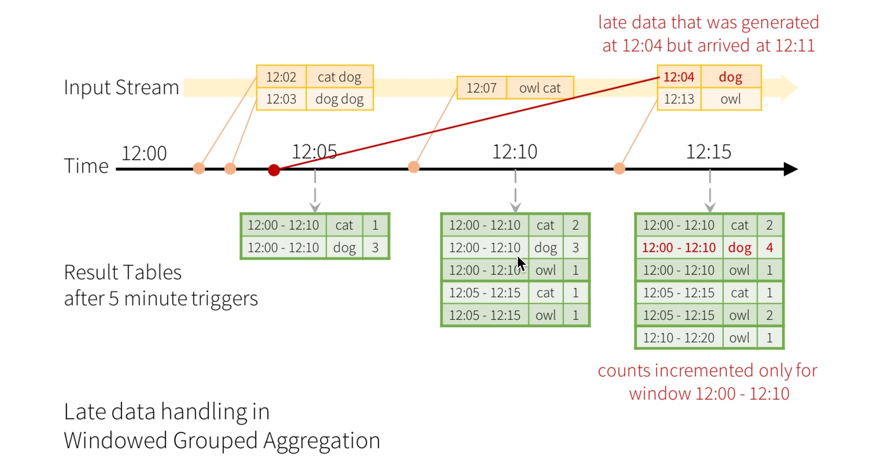
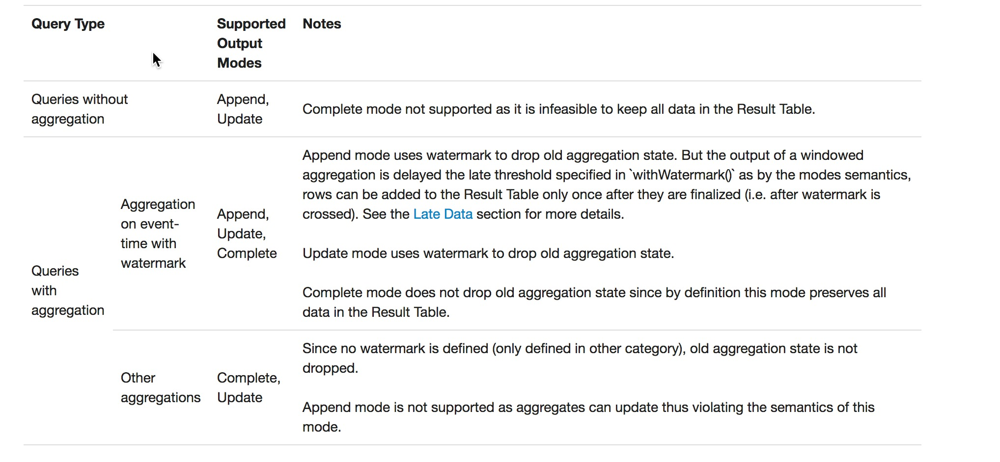
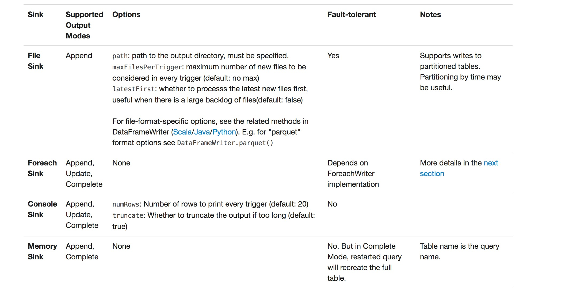

<script src="https://cdn.bootcss.com/pangu/3.3.0/pangu.min.js">
</script>

<script>
  pangu.spacingPage();
</script>

# Spark Streaming学习笔记

# 目录

* [Spark Streaming 基本工作原理](#一spark-streaming-基本工作原理)
    * [DStream](#11-dstream)
    * [Kafka 的 Receiver 和 Direct 方式](#12-kafka-的-receiver-和-direct-方式)
        * [基于 Receiver 的方式](#121-基于-receiver-的方式)
        * [基于 Direct 方式](#122-基于-direct-方式)
    * [transformation](#13-transformation)
        * [updateStateByKey](#131-updatestatebykey)
        * [transform](#132-transform)
        * [window](#133-window)
    * [output 和 foreachRDD](#14-output和foreachrdd)
    * [与 Spark SQL 结合](#15-与-spark-sql-结合)
* [缓存与持久化](#二缓存与持久化)
* [Checkpoint](#三checkpoint)
    * [何时开启 Checkpoint 机制](#31-何时开启-checkpoint-机制)
    * [如何配置 Checkpoint](#32-如何配置-checkpoint)
* [源码分析](#四源码分析)
* [Structured Streaming](#五structured-streaming)
    * [编程模型](#51-编程模型)
        * [event-time 和 late-data process](#511-event-time-和-late-data-process)
    * [流式 DataSet 和 DataFrame](#52-流式-dataset-和-dataframe)
        * [创建流式 DataSet 和 DataFrame](#521-创建流式-dataset-和-dataframe)
        * [对流式 DataSet 和 DataFrame 进行操作](#522-对流式-dataset-和-dataframe-进行操作)
        * [join 操作](#523-join-操作)
        * [不支持的操作](#524-不支持的操作)
    * [starting streaming query](#53-starting-streaming-query)
    * [managing streaming query](#54-managing-streaming-query)
    * [checkpoint](#55-checkpoint)
    * [源码及架构分析](#56-源码及架构分析)
    
    
        

## 一、Spark Streaming 基本工作原理
Spark Streaming 内部的基本工作原理如下：接收实时输入数据流，然后将数据拆分成多个 batch，比如每收集1秒的数据封装为一个batch，然后将每个batch交给Spark的计算引擎进行处理，最后会生产出一个结果数据流，其中的数据，也是由一个一个的batch所组成的。
<div align=center>
    
</div></br>

### 1.1 DStream
Spark Streaming 提供了一种高级的抽象，叫做 DStream，英文全称为 Discretized Stream，中文翻译为“离散流”，它代表了一个持续不断的数据流。DStream可以通过输入数据源来创建，比如Kafka、Flume和Kinesis；也可以通过对其他DStream应用高阶函数来创建，比如map、reduce、join、window。  

DStream的内部，其实一系列持续不断产生的RDD。RDD是Spark Core的核心抽象，即，不可变的，分布式的数据集。DStream中的每个RDD都包含了一个时间段内的数据。  
<div align=center>
    
</div></br>

对DStream应用的算子，比如map，其实在底层会被翻译为对DStream中每个RDD的操作。比如对一个DStream执行一个map操作，会产生一个新的DStream。但是，在底层，其实其原理为，对输入DStream中每个时间段的RDD，都应用一遍map操作，然后生成的新的RDD，即作为新的DStream中的那个时间段的一个RDD。底层的RDD的transformation操作，其实，还是由Spark Core的计算引擎来实现的。Spark Streaming对Spark Core进行了一层封装，隐藏了细节，然后对开发人员提供了方便易用的高层次的API。  
<div align=center>
    
</div></br>

Spark Streaming的具体工作原理如下：
<div align=center>
    
</div></br>

### 1.2 Kafka的Receiver和Direct方式

#### 1.2.1 基于Receiver的方式
这种方式使用Receiver来获取数据。Receiver是使用Kafka的高层次Consumer API来实现的。receiver从Kafka中获取的数据都是存储在Spark Executor的内存中的，然后Spark Streaming启动的job会去处理那些数据。  

然而，在默认的配置下，这种方式可能会因为底层的失败而丢失数据。如果要启用高可靠机制，让数据零丢失，就必须启用Spark Streaming的预写日志机制（Write Ahead Log，WAL）。该机制会同步地将接收到的Kafka数据写入分布式文件系统（比如HDFS）上的预写日志中。所以，即使底层节点出现了失败，也可以使用预写日志中的数据进行恢复。  

> 需要注意的点：  
    1、Kafka中的topic的partition，与Spark中的RDD的partition是没有关系的。所以，在KafkaUtils.createStream()中，提高partition的数量，只会增加一个Receiver中，读取partition的线程的数量。不会增加Spark处理数据的并行度。  
    2、可以创建多个Kafka输入DStream，使用不同的consumer group和topic，来通过多个receiver并行接收数据。  
    3、如果基于容错的文件系统，比如HDFS，启用了预写日志机制，接收到的数据都会被复制一份到预写日志中。因此，在KafkaUtils.createStream()中，设置的持久化级别是StorageLevel.MEMORY_AND_DISK_SER。

代码：[KafkaReceiverWordCount](./KafkaReceiverWordCount.scala)

#### 1.2.2 基于Direct方式
这种新的不基于Receiver的直接方式，是在Spark 1.3中引入的，从而能够确保更加健壮的机制。替代掉使用Receiver来接收数据后，这种方式会周期性地查询Kafka，来获得每个topic+partition的最新的offset，从而定义每个batch的offset的范围。当处理数据的job启动时，就会使用Kafka的简单consumer api来获取Kafka指定offset范围的数据。  

优点：
* 简化并行读取：  
如果要读取多个partition，不需要创建多个输入DStream然后对它们进行union操作。Spark会创建跟Kafka partition一样多的RDD partition，并且会并行从Kafka中读取数据。所以在Kafka partition和RDD partition之间，有一个一对一的映射关系。

* 高性能：  
如果要保证零数据丢失，在基于receiver的方式中，需要开启WAL机制。这种方式其实效率低下，因为数据实际上被复制了两份，Kafka自己本身就有高可靠的机制，会对数据复制一份，而这里又会复制一份到WAL中。而基于direct的方式，不依赖Receiver，不需要开启WAL机制，只要Kafka中作了数据的复制，那么就可以通过Kafka的副本进行恢复。

* 一次且仅一次的事务机制：  
基于receiver的方式，是使用Kafka的高阶API来在ZooKeeper中保存消费过的offset的。这是消费Kafka数据的传统方式。这种方式配合着WAL机制可以保证数据零丢失的高可靠性，但是却无法保证数据被处理一次且仅一次，可能会处理两次。因为Spark和ZooKeeper之间可能是不同步的。  
基于direct的方式，使用Kafka的简单api，Spark Streaming自己就负责追踪消费的offset，并保存在checkpoint中。Spark自己一定是同步的，因此可以保证数据是消费一次且仅消费一次。

代码：[KafkaDirectWordCount](./KafkaDirectWordCount.scala)

### 1.3 transformation
对于基础的操作就不一一列出来来，参考[官网文档](http://spark.apache.org/docs/latest/streaming-programming-guide.html#transformations-on-dstreams)

#### 1.3.1 updateStateByKey
updateStateByKey操作，可以让我们为每个key维护一份state，并持续不断的更新该state。
1. 首先，要定义一个state，可以是任意的数据类型；
2. 其次，要定义state更新函数——指定一个函数如何使用之前的state和新值来更新state。

对于每个batch，Spark都会为每个之前已经存在的key去应用一次state更新函数，无论这个key在batch中是否有新的数据。如果state更新函数返回none，那么key对应的state就会被删除。

> tip:  
   1、对于每个新出现的key，也会执行state更新函数。  
   2、updateStateByKey操作，要求必须开启Checkpoint机制。

代码：[UpdateStateByKey](./UpdateStateByKey.scala)

#### 1.3.2 transform
transform操作，应用在DStream上时，可以用于执行任意的RDD到RDD的转换操作。它可以用于实现，DStream API中所没有提供的操作。比如说，DStream API中，并没有提供将一个DStream中的每个batch，与一个特定的RDD进行join的操作。但是我们自己就可以使用transform操作来实现该功能。  
DStream.join()，只能join其他DStream。在DStream每个batch的RDD计算出来之后，会去跟其他DStream的RDD进行join。  

代码：[TransformBlacklist](./TransformBlacklist.scala)

#### 1.3.3 window
一些基础知识参看[官方文档](http://spark.apache.org/docs/latest/streaming-programming-guide.html#window-operations)  
代码：[WindowHotWord](./WindowHotWord.scala)

### 1.4 output和foreachRDD
DStream中的所有计算，都是由output操作触发的，比如print()。  

此外，即使你使用了foreachRDD output操作，也必须在里面对RDD执行action操作，才能触发对每一个batch的计算逻辑。否则，光有foreachRDD output操作，在里面没有对RDD执行action操作，也不会触发任何逻辑。

通常在foreachRDD中，都会创建一个Connection，比如JDBC Connection，然后通过Connection将数据写入外部存储。  
``` scala
dstream.foreachRDD { rdd =>
  rdd.foreachPartition { partitionOfRecords =>
    val connection = ConnectionPool.getConnection()
    partitionOfRecords.foreach(record => connection.send(record))
    ConnectionPool.returnConnection(connection)  
  }
}
```
代码：[PersistWordCount](./PersistWordCount.scala)

### 1.5 与Spark SQL结合
Spark Streaming最强大的地方在于，可以与Spark Core、Spark SQL整合使用，之前已经通过transform、foreachRDD等算子看到，如何将DStream中的RDD使用Spark Core执行批处理操作。现在就来看看，如何将DStream中的RDD与Spark SQL结合起来使用。  
代码：[Top3HotProduct](./Top3HotProduct.scala)


## 二、缓存与持久化
与RDD类似，Spark Streaming也可以让开发人员手动控制，将数据流中的数据持久化到内存中。对DStream调用persist()方法，就可以让Spark Streaming自动将该数据流中的所有产生的RDD，都持久化到内存中。如果要对一个DStream多次执行操作，那么，对DStream持久化是非常有用的。因为多次操作，可以共享使用内存中的一份缓存数据。

对于基于窗口的操作，比如reduceByWindow、reduceByKeyAndWindow，以及基于状态的操作，比如updateStateByKey，默认就隐式开启了持久化机制。即Spark Streaming默认就会将上述操作产生的Dstream中的数据，缓存到内存中，不需要开发人员手动调用persist()方法。

对于通过网络接收数据的输入流，比如socket、Kafka、Flume等，默认的持久化级别，是将数据复制一份，以便于容错。相当于是MEMORY_ONLY_SER_2。

与RDD不同的是，默认的持久化级别，统一都是要序列化的。

## 三、Checkpoint
每一个Spark Streaming应用，正常来说，都是要7 * 24小时运转的，这就是实时计算程序的特点。因为要持续不断的对数据进行计算。因此，对实时计算应用的要求，应该是必须要能够对与应用程序逻辑无关的失败，进行容错。  

如果要实现这个目标，Spark Streaming程序就必须将足够的信息checkpoint到容错的存储系统上，从而让它能够从失败中进行恢复。有两种数据需要被进行checkpoint：  
* 元数据checkpoint——将定义了流式计算逻辑的信息，保存到容错的存储系统上，比如HDFS。当运行Spark Streaming应用程序的Driver进程所在节点失败时，该信息可以用于进行恢复。元数据信息包括了：
    * 配置信息——创建Spark Streaming应用程序的配置信息，比如SparkConf中的信息。
    * DStream的操作信息——定义了Spark Stream应用程序的计算逻辑的DStream操作信息。
    * 未处理的batch信息——那些job正在排队，还没处理的batch信息。
* 数据checkpoint——将实时计算过程中产生的RDD的数据保存到可靠的存储系统中。要避免由于依赖链条越来越长，导致的一起变得越来越长的失败恢复时间，有状态的transformation操作执行过程中间产生的RDD，会定期地被checkpoint到可靠的存储系统上，比如HDFS。从而削减RDD的依赖链条，进而缩短失败恢复时，RDD的恢复时间。

元数据checkpoint主要是为了从driver失败中进行恢复；而RDD checkpoint主要是为了，使用到有状态的transformation操作时，能够在其生产出的数据丢失时，进行快速的失败恢复。

### 3.1 何时开启Checkpoint机制
* 使用了有状态的transformation操作——比如updateStateByKey，或者reduceByKeyAndWindow操作，被使用了，那么checkpoint目录要求是必须提供的，也就是必须开启checkpoint机制，从而进行周期性的RDD checkpoint。

* 要保证可以从Driver失败中进行恢复——元数据checkpoint需要启用，来进行这种情况的恢复。

### 3.2 如何配置Checkpoint
* 对于有状态的transformation操作，启用checkpoint机制，定期将其生产的RDD数据checkpoint，是比较简单的。

可以通过配置一个容错的、可靠的文件系统（比如HDFS）的目录，来启用checkpoint机制，checkpoint数据就会写入该目录。使用StreamingContext的checkpoint()方法即可。然后，你就可以放心使用有状态的transformation操作了。

* 如果为了要从Driver失败中进行恢复，那么启用checkpoint机制，是比较复杂的。需要改写Spark Streaming应用程序。

当应用程序第一次启动的时候，需要创建一个新的StreamingContext，并且调用其start()方法，进行启动。当Driver从失败中恢复过来时，需要从checkpoint目录中记录的元数据中，恢复出来一个StreamingContext。代码：[StreamingCheckpoint](./StreamingCheckpoint.scala)

重写应用程序只是第一步，要能够自动从Driver失败中恢复过来，运行Spark Streaming应用程序的集群，就必须监控Driver运行的过程，并且在它失败时将它重启。对于Spark自身的standalone模式，需要进行一些配置去supervise driver，在它失败时将其重启。  
首先，要在spark-submit中，添加--deploy-mode参数，默认其值为client，即在提交应用的机器上启动Driver；但是，要能够自动重启Driver，就必须将其值设置为cluster；此外，需要添加--supervise参数。

> tips:  
   将RDD checkpoint到可靠的存储系统上，会耗费很多性能。当RDD被checkpoint时，会导致这些batch的处理时间增加。因此，checkpoint的间隔，需要谨慎的设置。对于那些间隔很多的batch，比如1秒，如果还要执行checkpoint操作，则会大幅度削减吞吐量。而另外一方面，如果checkpoint操作执行的太不频繁，那就会导致RDD的lineage变长，又会有失败恢复时间过长的风险。  
   对于那些要求checkpoint的有状态的transformation操作，默认的checkpoint间隔通常是batch间隔的数倍，至少是10秒。使用DStream的checkpoint()方法，可以设置这个DStream的checkpoint的间隔时长。通常来说，将checkpoint间隔设置为窗口操作的滑动间隔的5~10倍，是个不错的选择。  
   

## 四、源码分析
未完待续

## 五、Structured Streaming
大多数的流式计算引擎（比如storm、spark streaming等）都仅仅关注流数据的计算方面：比如使用一个map函数对一个流中每条数据都进行转换，或者是用reduce函数对一批数据进行聚合。但是，实际上在大部分的流式计算应用中，远远不只是需要一个流式计算引擎那么简单。相反的，流式计算仅仅在流式应用中占据一个部分而已。因此现在出现了一个新的名词，叫做持续计算/应用，continuous application。  

Spark 2.0中，引入的structured streaming，就是为了实现上述所说的continuous application，也就是持续计算的。首先，structured streaming是一种比spark更高阶的api，主要是基于spark的批处理中的高阶api，比如dataset/dataframe。此外，structured streaming也提供很多其他流式计算应用所无法提供的功能：
```
1、保证与批处理作业的强一致性：开发人员可以通过dataset/dataframe api以开发批处理作业的方式来开发流式处理作业，进而structured streaming可以以增量的方式来运行这些计算操作。在任何时刻，流式处理作业的计算结果，都与处理同一份batch数据的批处理作业的计算结果，是完全一致的。而大多数的流式计算引擎，比如storm、kafka stream、flink等，是无法提供这种保证的。
2、与存储系统进行事务性的整合：structured streaming在设计时就考虑到了，要能够基于存储系统保证数据被处理一次且仅一次，同时能够以事务的方式来操作存储系统，这样的话，对外提供服务的实时数据才能在任何时刻都保持一致性。目前spark 2.0版本的structured streaming，仅仅支持hdfs这一种外部存储，在未来的版本中，会加入更多的外部存储的支持。事务性的更新是流式计算开发人员的一大痛点，其他的流式计算引擎都需要我们手动来实现，而structured streaming希望在内核中自动来实现。
3、与spark的其他部分进行无缝整合：structured steaming在未来将支持基于spark sql和jdbc来对streaming state进行实时查询，同时提供与mllib进行整合。spark 2.0仅仅开始做这些整合的工作，在未来的版本中会逐渐完善这些整合。
```


### 5.1 编程模型
structured streaming的核心理念，就是将数据流抽象成一张表，而源源不断过来的数据是持续地添加到这个表中的。这就产生了一种全新的流式计算模型，与离线计算模型是很类似的。你可以使用与在一个静态表中执行离线查询相同的方式来编写流式查询。spark会采用一种增量执行的方式来对表中源源不断的数据进行查询。我们可以将输入数据流想象成是一张input table。数据流中每条新到达的数据，都可以想象成是一条添加到表中的新数据。  
<div align=center>
    
</div></br>
针对输入数据执行的查询，会产生一张result table。每个trigger interval，比如说1秒钟，添加到input table中的新数据行，都会被增量地执行我们定义的查询操作，产生的结果会更新到结果表中。当结果表被更新的时候，我们可能会希望将结果表中变化的行写入一个外部存储中。  
我们可以定义每次结果表中的数据更新时，以何种方式，将哪些数据写入外部存储。我们有多种模式的output:

* complete mode，被更新后的整个结果表中的数据，都会被写入外部存储。具体如何写入，是根据不同的外部存储自身来决定的。
* append mode，只有最近一次trigger之后，新增加到result table中的数据，会被写入外部存储。只有当我们确定，result table中已有的数据是肯定不会被改变时，才应该使用append mode。
* update mode，只有最近一次trigger之后，result table中被更新的数据，包括增加的和修改的，会被写入外部存储中。这种mode和complete mode不同，没有改变的数据是不会写入外部存储的。

#### 5.1.1 event-time和late-data process

##### 5.1.1.1 event-time
event-time指的是嵌入在数据自身内部的一个时间。在很多流式计算应用中，我们可能都需要根据event-time来进行处理。例如，可能我们需要获取某个设备每分钟产生的事件的数量，那么我们就需要使用事件产生时的时间，而不是spark接受到这条数据的时间。设备产生的每个事件都是input table中的一行数据，而event-time就是这行数据的一个字段。这就可以支持我们进行基于时间窗口的聚合操作（例如每分钟的事件数量），只要针对input table中的event-time字段进行分组和聚合即可。每个时间窗口就是一个分组，而每一行都可以落入不同行的分组内。因此，类似这样的基于时间窗口的分组聚合操作，既可以被定义在一份静态数据上，也可以被定义在一个实时数据流上。

##### 5.1.1.2 late-data
late-data就是延迟到达的数据。spark会负责更新result table，因此它有决定的控制权来针对延迟到达的数据进行聚合结果的重新计算。虽然目前在spark 2.0中还没有实现这个feature，但是未来会基于event-time watermark（水印）来实现这个late-data processing的feature。

### 5.2 流式DataSet和DataFrame

#### 5.2.1 创建流式DataSet和DataFrame
流式DataFrame可以通过DataStreamReader接口来创建，DataStreamReader对象是通过SparkSession的readStream()方法返回的。与创建静态DataFrame的read()方法类似，我们可以指定数据源的一些配置信息，比如data format、schema、option等。spark 2.0中初步提供了一些内置的source支持。  
* file source：以数据流的方式读取一个目录中的文件。支持text、csv、json、parquet等文件类型。文件必须是被移动到目录中的，比如用mv命令。
* socket source：从socket连接中读取文本内容。driver是负责监听请求的server socket。socket source只能被用来进行测试。
* kafka source：要求kafka的broker版本是0.10.0及以上

还是来一个WordCount的例子:joy:：[StructuredNetworkWordCount](./structured/StructuredNetworkWordCount.scala)

#### 5.2.2 对流式DataSet和DataFrame进行操作

##### 5.2.2.1 基础操作
我们可以对流式DataSet/DataFrame执行所有类型的操作，包括untyped操作，SQL类操作，typed操作。
``` scala
case class DeviceData(device: String, deviceType: String, signal: Double, time: DateTime)

val df: DataFrame = ... // streaming DataFrame with IOT device data with schema { device: string, deviceType: string, signal: double, time: string }
val ds: Dataset[DeviceData] = df.as[DeviceData]    // streaming Dataset with IOT device data

// Select the devices which have signal more than 10
df.select("device").where("signal > 10")      // using untyped APIs   
ds.filter(_.signal > 10).map(_.device)         // using typed APIs

// Running count of the number of updates for each device type
df.groupBy("deviceType").count()                          // using untyped API

// Running average signal for each device type
import org.apache.spark.sql.expressions.scalalang.typed
ds.groupByKey(_.deviceType).agg(typed.avg(_.signal))    // using typed API
```
##### 5.2.2.2 基于event-time滑动窗口操作
``` scala
import spark.implicits._

val words = ... // streaming DataFrame of schema { timestamp: Timestamp, word: String }

// Group the data by window and word and compute the count of each group
val windowedCounts = words.groupBy(
  window($"timestamp", "10 minutes", "5 minutes"),
  $"word"
).count()

```
如下图所示：
<div align=center>
    
</div></br>

对于我们之前说的延迟到达的数据late-data，工作情况如下
<div align=center>
    
</div></br>

#### 5.2.3 join操作
structured streaming，支持将一个流式DataSet与一个静态DataSet进行join。
``` scala
val staticDf = spark.read. ...
val streamingDf = spark.readStream. ... 

streamingDf.join(staticDf, "type")          // inner equi-join with a static DF
streamingDf.join(staticDf, "type", "right_join")  // right outer join with a static DF
```

#### 5.2.4 不支持的操作
* streaming DataFrame的chain aggregation
* limit and take
* distinct
* sort：仅在聚合过后，同时使用complete output mode时可用
* streaming DataFrame和static DataFrame的outer join
    * full outer join是不支持的
    * streaming DataFrame在左侧时，left outer join是不支持的
    * streaming DataFrame在右侧时，right outer join是不支持的
* 两个streaming DataFrame的join是不支持的
* count() -> groupBy().count()
* foreach() -> df.writeStream.foreach()
* show() -> console output sink

### 5.3 starting streaming query

#### 5.3.1 output操作
定义好了各种计算操作之后，就需要启动这个应用。此时就需要使用DataStreamWriter，通过spark.writeStream()方法返回。此时需要指定以下一些信息：
* output sink的一些细节：数据格式、位置等。
* output mode：以哪种方式将result table的数据写入sink。
* query name：指定查询的标识。
* trigger interval：如果不指定，那么默认就会尽可能快速地处理数据，只要之前的数据处理完，就会立即处理下一条数据。如果上一个数据还没处理完，而这一个trigger也错过了，那么会一起放入下一个trigger再处理。
* checkpoint地址：对于某些sink，可以做到一次且仅一次的语义，此时需要指定一个目录，进而可以将一些元信息写入其中。一般会是类似hdfs上的容错目录。

#### 5.3.2 output mode
* append mode（默认）：仅适用于不包含聚合操作的查询。
* complete mode：仅适用于包含聚合操作的查询。
* update mode: 只有result table中的行自上一次操作以来有更新的话才写到output sink。
<div align=center>
    
</div></br>


#### 5.3.3 output sink
* file sink - 输出存储在一个目录中
``` scala
writeStream
    .format("parquet")        // can be "orc", "json", "csv", etc.
    .option("path", "path/to/destination/dir")
    .start()
```
* foreach sink - 对输出的结果执行任意的计算, 详见[foreach sink详解](#534-foreach-sink详解)
``` scala
writeStream
    .foreach(...)
    .start()
```
* console sink - 打印结果在控制台（仅仅用于调试）
``` scala
writeStream
    .format("console")
    .start()
```
* memory sink - 将结果存储在内存表中（仅仅用于调试）
``` scala
writeStream
    .format("memory")
    .queryName("tableName")
    .start()
```
<div align=center>
    
</div></br>

#### 5.3.4 foreach sink详解
使用foreach sink时，我们需要自定义ForeachWriter，并且自定义处理每条数据的业务逻辑。每次trigger发生后，根据output mode需要写入sink的数据，就会传递给ForeachWriter来进行处理。使用如下方式来定义ForeachWriter：
``` scala
datasetOfString.writeStream.foreach(new ForeachWriter[String] {

  def open(partitionId: Long, version: Long): Boolean = {
    // open connection
  }

  def process(record: String) = {
    // write string to connection
  }

  def close(errorOrNull: Throwable): Unit = {
    // close the connection
  }
})
```
需要注意一下几点：
* ForeachWriter必须支持序列化，因为该对象会被序列化后发送到executor上去执行。
* open、process和close这三个方法都会给executor调用。
* ForeachWriter所有的初始化方法，比如创建数据库连接，开启一个事务，打开一个IO流等等，都必须在open方法中完成。必须注意，如果在ForeachWriter的构造函数中进行初始化，那么这些操作都是在driver上发生的。
* open中有两个参数，version和partition，可以唯一标识一批需要处理的数据。每次发生一次trigger，version就会自增长一次。partition是要处理的结果数据的分区号。因为output操作是分布式执行的，会分布在多个executor上并行执行。
* open可以使用version和partition来决定，是否要处理这一批数据。此时可以选择返回true或false。如果返回false，那么process不会被调用。举个例子来说，有些partition的数据可能已经被持久化了，而另外一些partiton的处理操作由于失败被重试，此时之前已经被持久化的数据可以不再次进行持久化，避免重复计算。
* close方法中，需要处理一些异常，以及一些资源的释放。


### 5.4 managing streaming query
StreamingQuery对象在一个query开始的执行时候被创建出来，它可以用来监控和管理一个query
``` scala
val query = df.writeStream.format("console").start()   // get the query object

query.id          // get the unique identifier of the running query that persists across restarts from checkpoint data

query.runId       // get the unique id of this run of the query, which will be generated at every start/restart

query.name        // get the name of the auto-generated or user-specified name

query.explain()   // print detailed explanations of the query

query.stop()      // stop the query 

query.awaitTermination()   // block until query is terminated, with stop() or with error

query.exception       // the exception if the query has been terminated with error

query.recentProgress  // an array of the most recent progress updates for this query

query.lastProgress    // the most recent progress update of this streaming query
```
我们也可以在单个SparkSession中开启多个query。他们将并发的执行分享集群资源，可以使用sparkSession.streams()来获得StreamingQueryManager用来管理当前活跃的query
``` scala
val spark: SparkSession = ...

spark.streams.active    // get the list of currently active streaming queries

spark.streams.get(id)   // get a query object by its unique id

spark.streams.awaitAnyTermination()   // block until any one of them terminates
```

### 5.5 checkpoint
如果实时计算作业遇到了某个错误挂掉了，那么我们可以配置容错机制让它自动重启，同时继续之前的进度运行下去。这是通过checkpoint和wal机制完成的。可以给query配置一个checkpoint location，接着query会将所有的元信息（比如每个trigger消费的offset范围、至今为止的聚合结果数据），写入checkpoint目录。  
``` scala
aggDF
   .writeStream
   .outputMode("complete")
   .option(“checkpointLocation”, “path/to/HDFS/dir”)
   .format("memory")
   .start()
```

### 5.6 源码及架构分析
[Structured Streaming源码解析系列](https://github.com/lw-lin/CoolplaySpark/tree/master/Structured%20Streaming%20%E6%BA%90%E7%A0%81%E8%A7%A3%E6%9E%90%E7%B3%BB%E5%88%97)